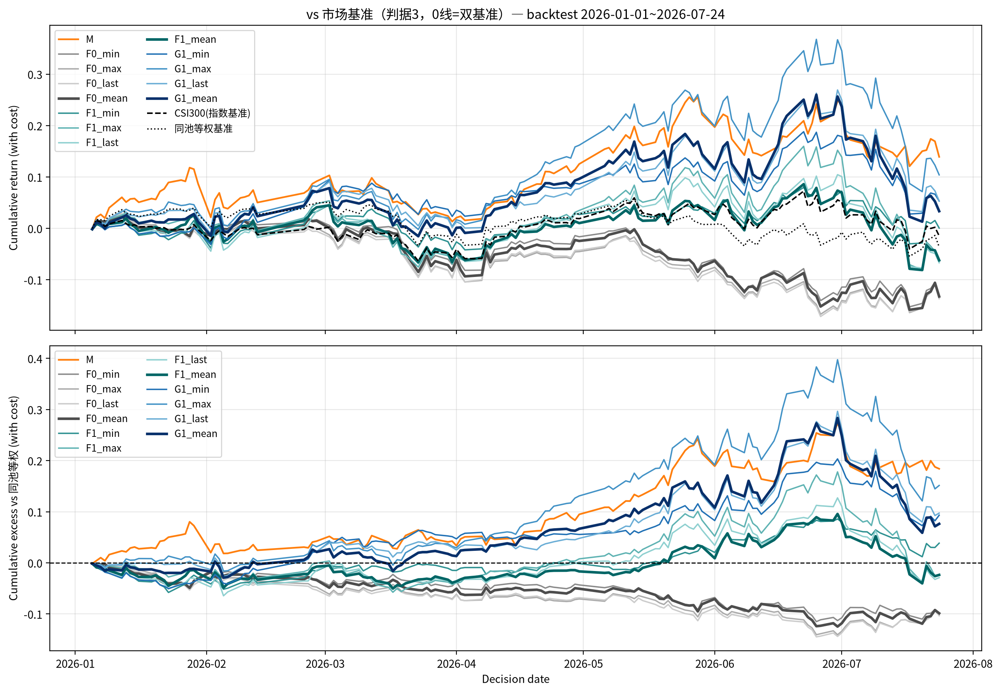
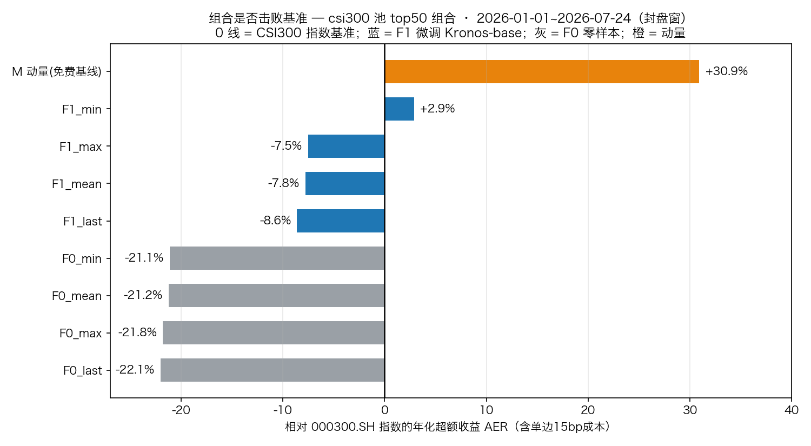
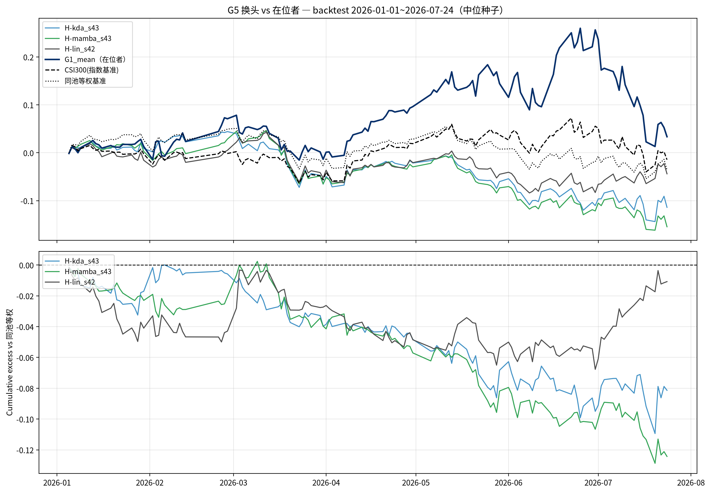
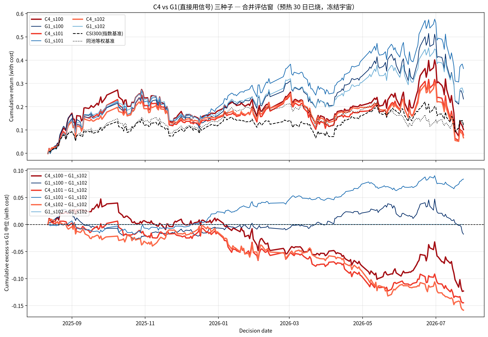

# Kronos A 股改造 · 全景图文总账

> 日期：2026-08-20 ｜ 交互流程图：[Kronos改造图谱_20260820.html](./Kronos改造图谱_20260820.html)（浏览器直接打开，自包含单文件，深浅色自适应）；在线版 https://claude.ai/code/artifact/cc592917-1c89-4201-9fe6-f1f9592e4e4b
> 本文档 = 图 + 数 + 技术细节的合订本。每轮的计划/结果原始文档见文末索引。
> 评估口径全程一致：**csi300 池 · top50/drop5 · min_hold=5 · 单边 15bp · 双基准（000300.SH + 同池等权）**。

---

## 1. 一张表看全貌

| # | 轮次 | 改动位于流水线哪一层 | 中位种子 AER(等权) | 判据 | 状态 |
|---|---|---|---|---|---|
| 0 | **F0** 零样本 | 无（官方权重原版） | −17.23% | — | 参照零点 |
| 1 | **F1** csi300 微调 | 权重（tokenizer+predictor） | −4.24% | 判据2 通过 | 被 G1 取代 |
| 2 | **G1** 全A 微调 | 权重（同上，语料 ×7.4） | **+14.33 ~ +29.06%** | 判据1~4 全过 | ✅ **在位** |
| 3 | **G4** 特征 | 输入层（6→9 列） | +11.68% | J5 否定 | ❌ 关闭 |
| 4 | **G5** 换头 | 输出层（AR 解码→监督头） | −14.32% | J5 否定 | ❌ 关闭 |
| 5 | **G7** 短窗 | 推理参数（L/H） | −22.04% | K3 否定 | ❌ 关闭 |
| 6 | **N50** 采样 | 推理参数（N） | +13.90% | N3 反常 | ❌ 关闭 |
| 7 | **C4** 后处理 | 信号层（时间维） | −2.65% | T5 否定 | ❌ 关闭 |
| — | **M** 10 日动量 | 免费基线（非本项目产出） | +36.02% | 裁判 | 参照 |

**读法**：F0→F1→G1 是同一件事的三级递进（只换语料）；G4~C4 是在 G1 之上五个方向的改造，全部关闭。

---

## 2. 在位者 G1 的完整技术规格

```
原始K线(90天 OHLCVA)
   → tokenizer   [全A微调·第一阶段]
   → predictor   [全A微调·第二阶段,加载冻结的新tokenizer后再训]
   → AR自回归生成 未来10天 × 20条采样路径
   → mean聚合    (10天均价 / 现价 − 1)
   → 组合引擎    (csi300 top50/drop5)
```

| 项 | 值 |
|---|---|
| 底座 | Kronos-base（102.3M）+ Tokenizer-base |
| 训练语料 | ashares 全 A PIT 并集，5,599 股 / 10,287,748 行日频，**2014-01-02 ~ 2024-12-31** |
| 早停段 | 2025-01-01 ~ 2025-06-30（85,149 行） |
| 训练协议 | 两阶段；epochs=15；batch=50；每 epoch 封顶 2000 步；lr tokenizer 2e-4 / predictor 4e-5 |
| 种子 | 100 / 101 / 102（三种子在册；另有 103/104 诊断种子） |
| 推理 | L=90 / H=10 / N=20 / T=1.0 / top_p=0.9 / seed=42 |
| 评估池 | **csi300**（训练语料是全 A，选股只在沪深 300——两者不同，勿混） |


*G1（蓝系）在 backtest 窗跑赢双基准；F0 零样本（灰系）深负；M 动量（橙）仍最强。*



**种子稳健性（G2 诊断）**：5 个 predictor 种子 backtest 窗等权 AER 全正（+10.74 ~ +29.06%）；换 tokenizer 种子（D-tok）差异仅 −2.41pp。

---

## 3. 五轮改造的技术细节（图上看不到的部分）

### 3.1 G4 · 输入层：加市场上下文特征

| 项 | 值 |
|---|---|
| 新增 3 列 | `idx_ret`（000300.SH 当日收益）、`mkt_vol`（指数 20 日滚动 std 年化）、`ma200_gate`（指数 > MA200 的 0/1） |
| 手术面 | tokenizer 入口 `Linear(6→d_model)` → `Linear(9→d_model)`，出口 head 同扩；**predictor 架构与词表不变** |
| warm-start | 前 6 列继承 G1 权重，新 3 列**零初始化** → 训练第 0 步严格等价于 G1（等价门禁测试钉死） |
| 种子 | 100/101/102 各自 warm-start 对应种子的 G1 权重 |
| 结果 | 中位 s101 +11.68%（等权）/ +8.07%（指数），低于否定线 +12.33% |
| 机制注记 | warm-start 未移动过拟合墙——predictor 仍 best=epoch 1 |

### 3.2 G5 · 输出层：换预测头（**就是 KDA / Mamba，见 §5**）

| 臂 | 结构（冻结底座输出 [B,90,832] 之后） | 可训练参数 | 中位 backtest AER(等权) |
|---|---|---|---|
| H-lin | `Linear(832→1)`（取末步） | **833** | **−1.95%**（三头里最好） |
| H-kda | `proj(832→256)` + `KimiLinearBlock×2`(nhead=8, ffn=256) + `Linear(256→1)` | 1,209,937 | −14.32% |
| H-mamba | `proj(832→256)` + Mamba `ResidualBlock×2`(d_state=16, expand=2) + RMSNorm + `Linear(256→1)` | 1,089,793 | −21.47% |

- 底座：**G1 微调权重，冻结**（`no_grad`，梯度只流过头）；
- 头训练协议：train 2022-01-04~2023-12-15 / 早停 2024-01-02~2024-06-14（10 日 purge）；标签 `close[t+10]/close[t]−1` 按日截面 z-score；MSE；AdamW lr=3e-4 wd=0.01 batch=128 epochs≤50 patience=5；
- 种子：42/43/44（H-lin 单种子）；共 7 次训练；
- 容量对齐：H-kda 计划规格 ffn=512 实测 1.603M 超区间 [0.8M,1.3M]，**训练前**最小修正 ffn→256 得 1.210M；
- **反直觉结果**：早停段 RankIC H-mamba 高达 +0.099~+0.113、H-lin +0.106（均高于 B3 的 +0.0765），但评估窗全塌——早停指标与样本外脱钩第三次确认。



### 3.3 G7 · 推理参数：短窗（用户 8/5 经验先验）

| 项 | 值 |
|---|---|
| 变量 | L=90→**8**，H=10→**5**（W85 单配置；W83=8/3 跑前撤除） |
| 不变 | 权重、N=20、T=1.0、top_p=0.9、seed=42、引擎参数 |
| 种子 | 100/101/102 × 两窗 × 四变体 = 12 组 |
| 结果 | 中位 s100 **−22.04%**，12 格全负；与在位者中位差 **−40.72pp**（远超噪声底） |
| 机制注记 | 零样本时代同配置只输 −4~−11%，本土化后输得更惨——**微调学到的是 90 天量级长程语法** |

### 3.4 N50 · 推理参数：采样路径 20→50

| 项 | 值 |
|---|---|
| 变量 | `sample_count` 20→50（论文敏感性曲线延长线） |
| 结果 | 中位 s102 +13.90%（< 在位者 −2pp 线 +16.67%）→ N3 反常 |
| **配对差（最有价值的数据）** | N50−N20 同种子：**+4.80 / −15.58 / −4.77pp，极差 20.4pp** |
| 由此得出 | **蒙特卡洛采样噪声 ≈ ±20pp，与训练种子摆动同级** → ±2pp 级判据线全部作废 |
| 执行事故 | 首跑 CUDA OOM（32×50=1600 序列），等序列预算缩块至 chunk=12 后统一口径重跑 |

### 3.5 C4 · 信号层：三值化 + 半衰期加权（威科夫 WSS 式）

| 项 | 值 |
|---|---|
| 第一步 | `e(t) = +1 若 G1_mean > +2%；−1 若 < −2%；否则 0` |
| 第二步 | `C4(t) = Σ_{k=0..29} λ^k · e(t−k)`，**λ = 0.5^(1/10)**（半衰期 10 交易日、窗口 30 日） |
| 评估窗 | 2025-08-12 ~ 2026-07-24（预热 30 日烧掉，230 交易日） |
| 结果 | 中位 s101 **−2.65%** / −3.17% 双非正 |
| 分窗分裂 | 2025H2 三种子**全正**（s100 +11.60%）；backtest 三种子**全塌**（−7.5~−10.1%） |
| T4 结构性发现 | C4 换手 10.00% vs G1 10.3%——**引擎每日强制换 5 只，机械换手约 10%/日，信号层平滑压不下去；降成本只能动引擎层** |


*红系（C4）自 2026-01 起持续阴跌半年——平滑=记忆，记忆=滞后，滞后在切换期致命。*

---

## 4. 论文自己说的改进方向（NotebookLM 核对原文）

论文**没有专设"局限"或"未来工作"章节**，结论章只总结两阶段框架与零样本 SOTA。正文/附录隐含三条限制：

| # | 限制 | 我们的处境 |
|---|---|---|
| 1 | **上下文长度上限 512 token**（算力约束）；作者建议用不同频率采样兼容任意预测跨度（1 分钟频服务超短期、日频服务周/月期） | 我们 L=90 远未触顶；这条实为**多频语料**的伏笔——对应搁置中的 G6 |
| 2 | **子 token 因子化的延迟折中**：n=2 是平衡点，n=4/5 会让融合层参数线性增加、自回归串行步数翻倍 | 与我们无关（未动词表结构） |
| 3 | **预训练语料资产失衡**（股票远多于加密/期货/外汇），需战略性重采样 | **与 G1 成功直接呼应**——我们做的正是"给 A 股加权到 100%" |

---

## 5. 东方证券五条思路的最终账（哪些还能用）

| # | 思路 | 我们做过什么 | 状态 |
|---|---|---|---|
| ① | 数据层：衍生特征 + **多周期融合** | G4 测了市场上下文列 → 关闭；**周频/月频融合从未测过** | ⚠️ **部分未测** |
| ② | 下游映射：路径 A（收益率因子化）/ 路径 B（隐表征提取） | 路径 A = canonical 主线（已充分测）；路径 B = B2/B3/T1 + G5，**两代底座双重证伪** | ❌ 关闭 |
| ③ | DFQ-Diversify 对抗解耦 | 宿主（存活的监督头）已死，未落地；报告本身也无公式细节 | ❌ 取消 |
| ④ | **生成能力工具化：压力测试与情景模拟** | **完全没做过** | ✅ **可用，且不与任何结论冲突** |
| ⑤ | 工程路径：模块化分步嵌入 | 全程照做 | ✅ 已完成 |

**结论：还剩两条能用，性质完全不同——**

- **④ 生成能力工具化（推荐）**：用 Kronos 的多路径蒙特卡洛生成虚拟未来 K 线，做**策略压力测试与极端情景模拟**——评估现有组合在未经历的高波动/流动性冲击下的最大回撤与生存率。**它不是 alpha 信号**，因此不受"五路改造全关"影响；而且它用的正是模型唯一被验证的能力（生成），成本低、无多重检验负担。若 11 月 G1 通过首读进入滚动期，这是给它配风控的天然一步。
- **① 多周期融合（谨慎）**：报告主张把周频/月频结构特征融进输入，目的仍是 alpha。**但 G4 已经证明"往输入加列"这条路走不通**（市场上下文列是同类手术），先验因此大幅下调；真要试，更合理的形态是走论文限制 #1 暗示的**多频语料预训练**（即 G6），而不是再加几列。

---

## 6. KDA / Mamba 到底是不是 G5？

**是，但要区分两代**——同样的头，在两个不同底座上各死过一次：

| 代 | 轮次 | 底座 | 臂 | 结果 |
|---|---|---|---|---|
| 第一代 | 第 2~3 轮 | **零样本官方权重**（冻结） | B2 线性 / B3 KDA 头 / T1 Mamba 头 | B3 曾单种子转正（+3.53%），**D1 种子诊断拆穿为种子运气**；T1 三种子全负 → 路径 B 关闭 |
| 第二代 | **G5** | **G1 本土化微调权重**（冻结） | H-lin / H-kda / H-mamba | 七次训练全负（−1.95 / −14.32 / −21.47%）→ 命题终审否定 |

所以严格说：**G5 = "换头"这条思路的第二次、也是决定性的一次审判**——因为它用的是已被多种子验证的好底座，排除了"底座不行才连累头"的辩护。两代合计 15 次头训练，无一存活。

定论：**alpha 住在"生成 20 条未来路径再平均"这个计算过程里**，不在隐状态里等着被某个头读出来。任何监督头做的都是"读出"，而要读的东西不在那儿。

---

## 7. 现在的状态与下一步

- **在位**：G1 原版 AR 出口（约 34 挑 1）；
- **自动运行**：G3 前瞻登记 cron 每交易日 16:30 盖章（登记级五臂 + 复算级四臂）；
- **已冻结待裁**：C1 三种子集成、C2 MA200 切换、C3 混合（0.5·C1+0.5·M）；
- **下一个人工动作**：**2026-11 forward 结算**——`python -m settlement.executor` 一条命令，判据只做代入，两条分支（关闭 / 滚动确认）文书已写好；
- **货架**：④ 生成能力工具化（推荐，非 alpha）、G6 多频语料（重注，搁置中）、全市场池扩展（需 ~5 GPU 天推理）。

---

## 8. 原始文档索引

| 轮次 | 计划 | 结果 |
|---|---|---|
| 论文复现 | `论文口径复现计划_20260810.md` | `论文口径复现结果_20260810.md` |
| 基准 + 样本外 | `基准与样本外测试计划_20260810.md` | `基准与样本外测试结果_20260810.md` |
| 改进五阶段 | `改进实验预注册计划_20260812.md` | `改进实验结果_20260812.md` |
| Mamba 时序头 | `Mamba时序头实验计划_20260813.md` | `Mamba时序头实验结果_20260813.md` |
| 三轮总账 | — | `Kronos实验总账判读_20260813.md` |
| F1 微调 | `Kronos微调实验计划_20260814.md` | `Kronos微调实验结果_20260814.md` |
| G1 扩语料 | `扩语料微调实验计划_20260815.md` | `扩语料微调实验结果_20260815.md` |
| G2/G3 | `种子诊断与前瞻登记计划_20260816.md` | `种子诊断结果_20260816.md` |
| G5 换头 | `G5预测头魔改实验计划_20260817.md` | `G5实验结果_20260817.md` / `G5归因分析_20260817.md` |
| G4 特征 | `G4特征微调实验计划_20260817.md` | `G4实验结果_20260818.md` |
| G7 短窗 | `G7短窗推理实验计划_20260818.md` | `G7实验结果_20260818.md` |
| N50 采样 | `N50放大实验计划_20260819.md` | `N50实验结果_20260819.md` |
| C4 后处理 | `C4时间维因子实验计划_20260820.md` | `C4实验结果_20260820.md` |
| 组合规则 | `组合规则预注册_20260816.md` / `C3混合规则预注册_20260818.md` | 待 2026-11 |
| 结算与运营 | `forward结算计划_20260818.md` / `滚动再训协议_20260819.md` | 待 2026-11 |
