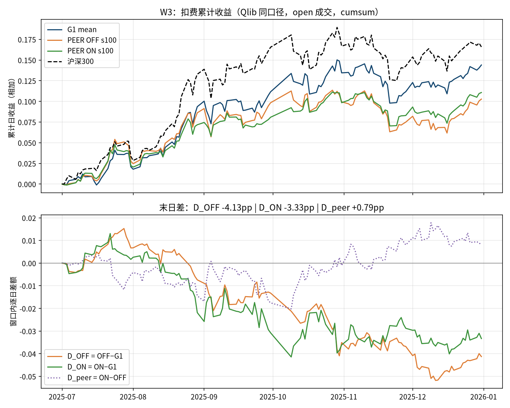
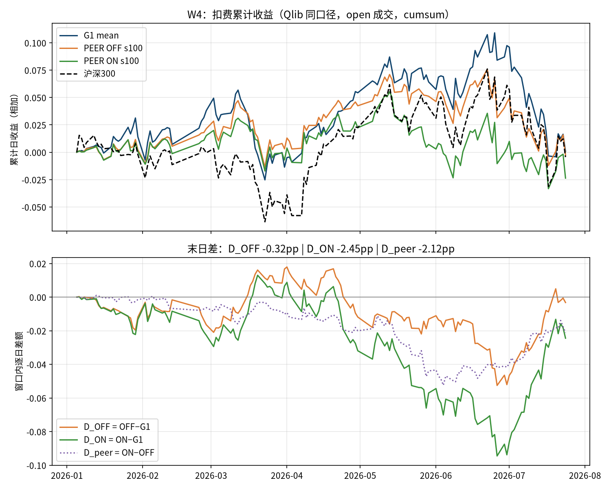

# Kronos 残差预测头研究结论与封盘记录（2026-09-11）

> 本文是主分支上的最新结论入口，补充[2026-09-10 初版研究总结](Kronos预测层优化研究总结_20260910.md)。研究证据截止 `61d2df4`，工程修复截止 `e8a19e3`；Debian 验收于 2026-09-11 由用户回传。关键数据已复制到主分支[只读证据档案](实验档案/20260911/README.md)，不依赖实验分支继续存在才能查看结论。

## 1. 保留的最终决策

**继续以项目已有 G1 s100 mean 为比较基线；AE/SAE 残差头和 PEER 同日跨股交互残差头均未在固定 Qlib 口径下达到两窗同时超过 G1 的目标，本配置封盘。** seed101/102 确认阶段未启动，不因工程修复、算力剩余或某个单窗较好而补种子、调参或重开。

工程收尾完成不等于模型优化成功。当前证据没有建立一个可替代 G1 mean 的结构优化版本，也不能推论所有 SAE、attention、TimesFM 或 Kronos 改造都无效。

## 2. 用户真正要比较的对象

- 优化目标是超过**项目 G1 mean 曲线**，不是只超过沪深300，也不是比一个较弱的实验臂好。
- W3：2025-07-01 至 2025-12-31，共126日；W4：2026-01-01 至 2026-07-24，首交易日2026-01-05，共134日。
- FULL 逐日信号、同候选股票格、同 Qlib 原生 TopkDropout50/5/hold5、open 成交、买0.001/卖0.0015/min5、涨跌停阈值0.095、初始资金1亿。沿用内部 t 信号供 t+1 执行，不额外平移。
- 主指标为 `cumsum(report['return'] - report['cost'])` 的窗口末值；相对差额以百分点 pp 表示。这不是复利收益、年化超额或 RankIC。
- G1 固定信号 SHA：W3 `9352b40302eb34c714bfebd808481b625a21d2f7f4f668ccca15cda0cfe21d66`；W4 `453e2aeae7fe4bee8ce8fa62a9908da0843d5ad8b52777cd3b299a84cc4a3e36`。

## 3. 实验结果：两条残差路线均未成功

| 方案（seed100） | W3累计 | W4累计 | W3相对G1 | W4相对G1 |
|---|---:|---:|---:|---:|
| G1 mean | +14.40% | +0.08% | — | — |
| AE residual | +13.87% | −6.95% | −0.53pp | −7.03pp |
| SAE residual | +11.60% | −6.05% | −2.80pp | −6.13pp |
| PEER_OFF（仅看自身） | +10.28% | −0.24% | −4.13pp | −0.32pp |
| PEER_ON（同日股票间交互） | +11.07% | −2.37% | −3.33pp | −2.45pp |

AE/SAE 相同残差预测任务，稀疏约束带来的差额两窗方向不同。PEER_OFF/ON 使用相同结构、初始化、监督样本和训练设置，主要变量是 attention 能否访问其他股票；ON−OFF 为 W3 **+0.79pp**、W4 **−2.12pp**，未观察到稳定额外收益。

PEER 以当日 PIT 沪深300合格历史窗口股票组成 PeerSet，训练每日64只原 SAE 样本仅作 LossSet，额外股票仅提供上下文；不能误记为“训练64股context、测试300股context”。两臂各100epochs，固定验证最低 MSE 选点 OFF e18、ON e16。

来源：[SAE f6c0726](https://github.com/hugo2046/Kronos/commit/f6c0726)、[PEER1 c9c56a0](https://github.com/hugo2046/Kronos/commit/c9c56a0)。主分支有原值汇总及 PEER 六份逐日报告，可离线复算；表格经过舍入。

## 4. 补诊断后的关键认识

此前只报告头之间的验证 MSE，遗漏“不修正 G1”的零残差基准。`61d2df4` 使用同一历史缓存、固定两个 best 头、日期等权和同 LossSet，在 CPU 上补齐对照。

| 诊断指标 | G1 | OFF e18 | ON e16 |
|---|---:|---:|---:|
| train MSE（归一化） | 1.008674 | 0.887990 | 0.814830 |
| val MSE（归一化） | 0.701010 | 0.658049 | 0.661352 |
| val MSE相对改善 | — | **6.13%** | **5.66%** |
| train日均RankIC | +0.0769 | +0.1232 | +0.1516 |
| val日均RankIC | +0.0461 | +0.0392 | +0.0387 |
| val配对RankIC差 | — | **−0.0069** | **−0.0074** |

**预测数值误差确有改善，但验证期截面排序没有同步改善；约6%的误差改善不是6%的收益提升。** 修正量具有真实截面变异，但“改变了排名”不等于“产生有效 alpha”。这提供了目标与排序未同步改善的诊断证据，不证明策略失败只由 MSE 或换手中的某一个原因造成。

训练534日期、34176监督格；验证22日期、1408监督格。训练残差来自在该历史上训练过的 G1，存在样本内限制；验证期与 G1 原选模验证期重叠，不能当作完全独立的确认样本。这与“训练和测试含相同股票”是不同问题：股票身份重叠本身不等于未来价格泄漏。

Mac 从35,584行原值小表独立复算：MSE 与归档汇总的最大差约 `3.74e-9`，RankIC 一致。无需大 h 缓存即可复算这些诊断，但不能据此声称已完整重新提取表示或重生原测试信号。

来源：[诊断 61d2df4](https://github.com/hugo2046/Kronos/commit/61d2df4)，[主分支诊断数据](实验档案/20260911/diagnostic/)。

## 5. 必须随结论保留的勘误

1. **历史读取边界不符合协议。** 旧 PEER 窗口函数先请求到未来第10交易日，再截取输入至 t；合成复现 t=2026-07-24 时请求到2026-08-07。最后模型输入只到 t，实际数据库返回范围无请求日志可证，不能称已证明未来价格进入模型，也不能维持“forward零读取”声明。
2. **旧信号先回测、后保存。** 未执行全部信号先冻结再统一回测；后续修复不追认原顺序。
3. **旧身份信息不完整。** checkpoint 缺 run/base/cache 等身份，旧生成链不能靠事后补 SHA 追认。`historical_protocol_conformance=false` 和 `legacy_identity_incomplete` 保持原状态。
4. `61d2df4` 虽新增独立身份函数与测试，实际训练/推理仍走旧 schema、复用失败会重训，冻结回测也只检查部分文件 SHA；`e8a19e3` 才补齐这些生产入口。不能把64项测试通过解释为当时已完整接线。

上述缺陷不把已复算的负收益变成正收益，也不是为了让旧记录看起来完整而无限重训的理由。原始结果、诊断结果和修复状态分别保存。

## 6. 工程收尾状态（已完成）

`e8a19e3` 接通了实际训练/推理的新身份校验；失败立即停止，不自动重训或覆盖中断产物；缓存装配前检查完整键集和逐文件 SHA；冻结并核验 G1 基线、所有头和所有信号；回测只读已核验快照。旧头保留明确的只读诊断路径，不自动升级。

- Mac：五个测试文件75项全部通过；39件交接资产 SHA 一致，原诊断数据未修改。
- Debian：用户于2026-09-11回传，独立 worktree ff-only 更新到 `e8a19e3` 后 conda quant / CPU 下 **75 passed，1.59s**，39/39 SHA 一致；未运行真实训练、回测、数据库或 GPU。此项来源为用户转述的执行报告，不冒称本地直接读取了 Debian 日志。
- 无需再重跑 PEER1；没有自动启动新实验或解除封盘。

固定修复：[e8a19e3](https://github.com/hugo2046/Kronos/commit/e8a19e3)；[主分支修复说明快照](实验档案/20260911/engineering/PEER生产身份接线修复_20260910.md)。

## 7. 后续任务先读这些边界

1. 用户仍希望从预测头或相关结构优化 Kronos；不能把工作自动替换为挑历史最优 seed、长期登记或无休止的工程检查。
2. 若继续残差研究，先定义底座训练/选模早于残差生成日期的时间隔离方案。把最终 G1 回推到自己训练过的历史，不构成 OOF。本轮未执行新的 OOF 或重训。
3. “MSE改善但排名未改善”不能直接授权再试一轮排名损失。此前 R1/H1 等已涉及相关目标，需要先与旧分支去重，明确新的可检验差别。
4. W3/W4 已多次观察，历史两窗赢过 G1 最多作为开发期证据，不能宣称由此排除了过拟合。历史挑出的 s102 候选也不能算结构优化成功。
5. 2026-07-25起真实 forward 数据继续封存；本结论不授权开封、训练新变体、更改在位策略或新增自动任务。

实现分支保留：`codex/sae-residual-plan`、`codex/peer-residual-plan`、`codex/peer-diagnostic-plan`。本文和关键证据直接进入 master，未来从主分支创建任务即可看到；旧 worktree 不会自动收到文档，需要显式同步或直接阅读 master。
