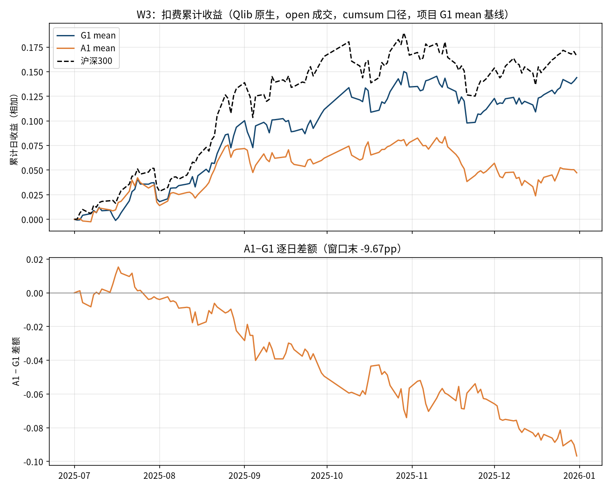
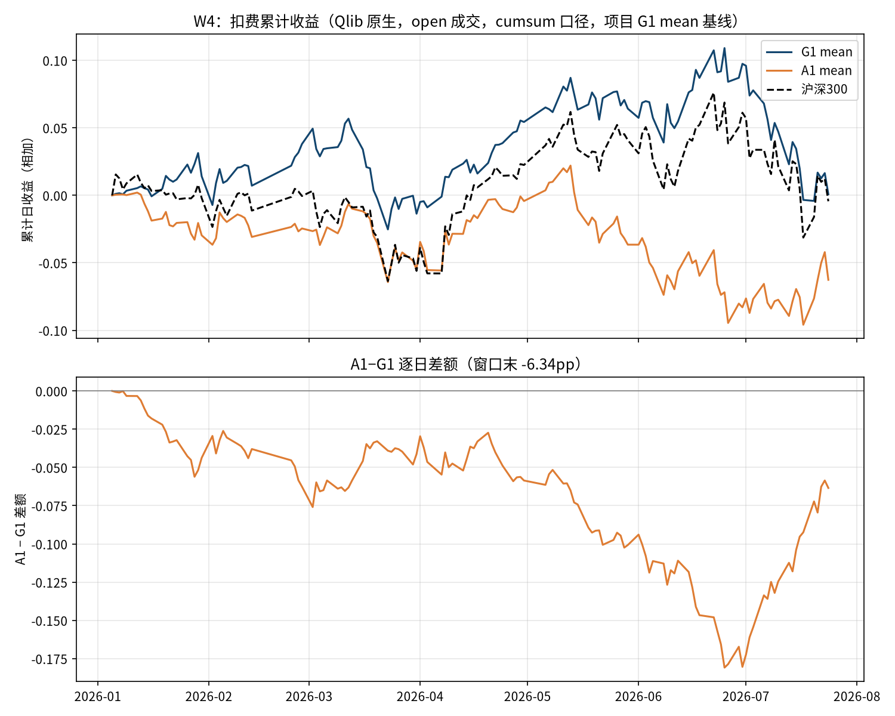
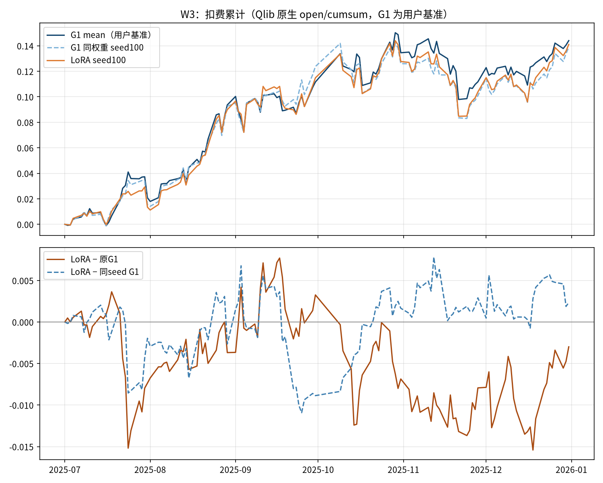
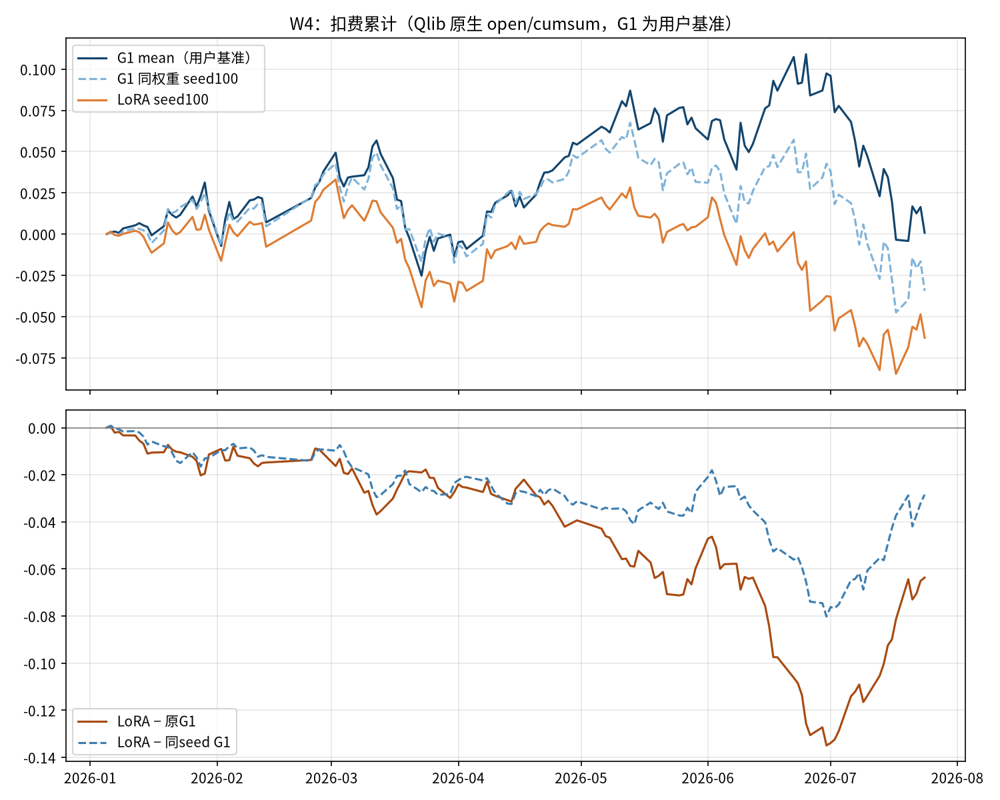

# Kronos 预测层优化研究总结（2026-09-10）

> **后续结论已更新：** [2026-09-11残差预测头封盘记录](Kronos残差预测头研究结论与封盘记录_20260911.md)补齐已完成的SAE、PEER1、零残差诊断及工程验收；本篇保留初版截至LoRA阶段的历史范围，后续状态以新记录为准。

> 本文将2026-09-07至09-10这条研究链集中到仓库主分支，供后续任务直接阅读。结论截止于LoRA补交提交`be2ff61`。原实验代码和运行历史仍在各实验分支；主分支归档的是总结、关键数字、图表及分析数据，不把所有实验实现混入主干。

## 1. 最终结论

**目标是让优化方案在同一套Qlib回测中超过项目已有的G1 mean，而不是仅仅超过沪深300。到目前为止，本研究链尚未产生满足这一目标的替代版本。**

- G10原生DualHead-only：同口径Qlib下，W3/W4分别落后G1 mean **9.67/6.34个百分点**。
- 主干LoRA seed100 pilot：W3/W4分别落后G1 mean **0.30/6.37个百分点**；未触发101/102确认阶段，本配置封存。
- MH1多期限监督：相对单期限头的RankIC增益两窗反向，没有稳健额外贡献；同时存在已披露的训练池协议偏差。
- A0全参数重训最佳点不是受限适配成功；在最终统一Qlib比较中，也没有超过G1 mean。
- **继续把G1 mean作为比较基线。** 这不等于证明G1稳健盈利，也不等于所有Kronos优化方法都无效。

“失败”在本文指固定实验方案未达到既定比较目标；“未完全验收”指实现或历史证据还有缺口。两者必须分开，不用一个词代替另一个。

## 2. 用户确认的比较目标与统一口径

用户提供了原`finetune/qlib_test.py`的曲线示例，并明确选择**项目已有G1 mean**作为主基线；截图本身没有足够信息证明其未知模型权重就是本项目G1，不对截图曲线做数字对拍。

| 项目 | 最终用于判断“是否超过G1 mean”的口径 |
|---|---|
| W3 | 2025-07-01至2025-12-31，126个交易日 |
| W4 | 2026-01-01至2026-07-24，实际首交易日2026-01-05，共134日 |
| 原模型主基线 | G1 s100既有FULL逐日mean信号，文件SHA固定 |
| mean定义 | `mean(pred_close[t+1..t+10])/close_t - 1`；与截图脚本归一化空间价差不混同 |
| 引擎 | Qlib原生TopkDropoutStrategy，top50/drop5/hold5，独立账户 |
| 成交和费用 | open成交；买0.001/卖0.0015/最低5；limit_threshold0.095；初始资金1亿 |
| 信号时序 | 已有Qlib构建内部shift=1，t日信号供t+1开盘；不额外平移 |
| 基准 | 沪深300仅作市场参考；DDB编码`SH000300`与展示名000300.SH需核对实际序列 |
| 主图 | `cumsum(report['return']-report['cost'])`，日收益相加，不是复利净值 |
| 主比较 | 同窗末日“优化曲线−G1 mean曲线”，以百分点报告；不要求每天都高于、不另加必须跑赢沪深300的门槛 |

所有表述中的百分数属于所标注的收益口径。RankIC是相关系数；它的差值不能当成策略收益百分点。复利收益、累计超额和年化超额也不可混用。

## 3. 最终同口径Qlib结果

### 3.1 原生DualHead-only与全参数重训参考

以下均为扣费日收益cumsum；原始逐日报告在[Qlib证据目录](实验档案/20260910/qlib_mean/)。

| 方案 | W3累计 | W4累计 | W3相对G1 | W4相对G1 |
|---|---:|---:|---:|---:|
| G1 mean | +14.40% | +0.08% | 0 | 0 |
| G10 A1 mean（DualHead-only） | +4.73% | −6.26% | **−9.67pp** | **−6.34pp** |
| G10 A0 bestCE mean（全参数参考） | +14.34% | −2.09% | −0.07pp | −2.17pp |

A1高于G1的日期：W3为14/126，W4为0/134。A0仅为参考，不能以其较好的数字替代A1主结论。Mac复算逐日报告与上述结果一致，相关6项测试在当时源码版本通过。

### 3.2 主干LoRA pilot

LoRA只更新12层attention q/k/v/out的rank8、alpha8适配参数，共638,976个；从G1 s100继续训练，原权重冻结。训练seed100，15epochs，bestCE为e10（CE≈3.23054）。下表沿用同一Qlib扣费cumsum口径。

| 方案 | W3累计 | W4累计 |
|---|---:|---:|
| G1_original_mean（用户主基线） | +14.40% | +0.08% |
| G1_paired_100（同一基底本轮重推） | +13.87% | −3.44% |
| LoRA_100 | +14.10% | −6.29% |

- LoRA−原G1：W3 **−0.2986pp**，W4 **−6.3673pp**。
- LoRA−本轮同seed G1：W3 **+0.2353pp**，W4 **−2.8426pp**。
- pilot要求两窗同时超过原G1与同seed G1；没有通过，101/102确认未启动，不搜索其他rank/lr或注入位置。

原G1与本轮G1_paired的差异不能被称作已经测定的“采样噪声带”：两代生成管线不同，旧生成链未验证。一次差异不足以估计噪声分布。源码每日重播种有助于独立续推，但不能仅凭manual_seed证明跨执行条件逐位一致。

## 4. 研究经过与各实验到底测试了什么

| 阶段 | 研究问题 | 实际观察与处理 |
|---|---|---|
| 既有H1/G5/R1背景 | 冻结Kronos表示上训练收益读出头是否有用 | 已有单期限读出实验，跨窗表现不稳；新增工作必须先读旧结果，不能当作从未测试 |
| TimesFM启发 → MH1 | 多期限联合监督能否比单期限监督更好 | 相同共享MLP四输出，S只训10日，M训1/5/10/20日；三seed配对，RankIC差W3 +0.0212、W4 −0.0081，合并分段HAC t≈0.67，未通过 |
| MH1纠偏 | 报告里的“v2”是否真实、训练池是否符合计划 | 实际走旧引擎，后修真实v2；训练历史并集578–737股/日，平均55.14%非当日沪深300成员；原“全按协议”撤回 |
| G1日期对照 | G1由负转正是否来自裁剪信号日期 | 完整信号与裁剪尾部20日的信号在W4发生符号翻转；不能选较漂亮的裁剪版作基准 |
| G10H A0/A1 | 仅训练原生token粗/细输出头是否优于全参数且保留末期信息 | A1无优势；A0早期较末期好，但实现存在RNG偏差与权重误标事件；只保留实际执行口径观察 |
| Qlib mean直接对照 | 优化是否真正高于用户的G1 mean线 | 两窗A1均落后，原先围绕指数/IC的复合门槛不能代替此主目标 |
| 主干LoRA | 允许主干低秩调整是否改善G1 mean | 当前固定配置seed100未超过基线，两窗pilot失败，确认停止 |

**这不是TimesFM整体失败的结论。** MH1只是借鉴多期限监督；TimesFM式输入patch与一次生成未来一段的结构没有测试。G10 DualHead-only和LoRA也不是TimesFM复现。

SAE在本文初版时尚为候选，随后已执行并封盘：AE/SAE残差头均未在两窗同时超过G1，见[最新记录](Kronos残差预测头研究结论与封盘记录_20260911.md)。AlphaFarmer中的指数择时复现属于不同任务、不同工程，不能用它的收益宣称已优化Kronos股票排序。

## 5. 为什么必须保留“日期/引擎不同”的说明

以下为**自定义真实v2的累计指数超额**，用于解释日期效应，不能与§3的Qlib cumsum策略收益混排。

| G1信号日期 | W3累计指数超额 | W4累计指数超额 |
|---|---:|---:|
| FULL完整逐日 | +8.14% | **−1.85%** |
| CROPPED按MH1裁剪 | +8.70% | **+1.31%** |

两版本仅在连续尾部20个信号日不同，之前逐日净收益一致。CROPPED尾部仍有最后决策的pending订单成交，不是简单“绝对无交易”。完整G1 W4年化指数超额−3.48%与较早v2结果闭合。差异同时涉及尾部持仓变化和交易费用，不能全归于费用。

在真实v2下A0_e1曾两窗净超额为正，在最终Qlib原生比较下却未超过G1；这是**换了回测口径**，不能从两张表择优宣布模型成功。

## 6. 工程与证据状态：后续任务不能省略的背景

- G10首次误把e15权重当bestCE，后修保存并重训A0；两轮CE近似复现，最大差约2.7e-7，不能称权重或CE逐位复现。
- G10旧训练的验证RNG位置不符预注册；历史V撤回，旧生成链标`legacy_unverified`。后来修代码并不能追溯证明历史运行完全符合协议。
- `c903a2d`的runtime修复仍有审查发现：新run结束局部导入未绑定、缺RNG链仍续推、恢复使用eval、身份检查不完整。它不是已经验收的通用训练框架，不要直接复制投入训练。
- Qlib R可用于统一实验参数/指标/产物/状态，已在Mac隔离环境验证。R的resume恢复记录而非自动恢复训练；同名artifact可被覆盖，仍需明确身份和保存语义。
- `0b982e8`源码的R.start未进入with、以Path对象保存图像有接线问题；这不改变已导出的逐日报告复算结果，但不应声称记录系统已完整验收。以后正确使用with R.start与文件artifact上传。
- LoRA首次提交`a29659c`漏源码/测试/报告，后`be2ff61`补齐。Mac当时11项测试通过；最终两窗信号确有126/134日且两臂索引/缺失位置一致。
- LoRA续推判断仍以“至少100列”代替完整日期集合，未来复用前必须修复；本次实际交付日期完整，因此该潜在缺陷未推翻已复算的收益数字。完整连续/续推生产路径并未由这些11项测试充分证明。
- 预算累计器与实际GPU执行不是同一口径。无逐attempt充分证据时写记录值与限制，不把累计数包装成独立核验结果。

**数据时间问题的澄清：** 训练集与测试集包含相同股票不等于未来数据泄漏。G10/LoRA预定使用全A历史数据；不能要求它们必须改为沪深300训练。MH1的历史并集首先是与原PIT训练计划不一致，不能单凭股票集合重叠断言使用未来价格。

## 7. 当前决策与未来工作边界

1. 本配置下的MH1、G10 DualHead-only、LoRA结果保留为未成功的实验，不自动继续扩参/换seed；DHead蒸馏pilot的既有失败门禁不因本研究链而解锁。
2. 继续以用户确认的G1 mean作比较基线；主判断是同Qlib、同日期、同股票集合和费用下的相对收益，不把指数盈利或漂亮单窗代替目标。
3. 不自动更改在位策略、合成新模型或读取forward；截至2026-07-24后的登记期继续按既有封存纪律处理。
4. 需要新研究时先读本文与固定提交证据，提出一个确有差别的命题，不把相同实验重新命名再做。
5. 无需为了让旧实验“看起来完整”不断重训；可以如实封存实际结果及执行限制。若要严格复验另立协议，不能覆盖旧记录。

## 8. 原始分支与固定提交索引

所有链接固定到提交，分支后续移动也不会改变本文引用的版本。原报告中的完成声明需结合上面的审计勘误理解。

| 事项 | 固定提交 | 分支/入口 |
|---|---|---|
| MH1计划 | [e908fd1](https://github.com/hugo2046/Kronos/commit/e908fd1eb3a521a8993342aea6d8edbbdc0f393b) | codex/timesfm-multihorizon |
| MH1结果 | [39d51ac](https://github.com/hugo2046/Kronos/commit/39d51ac7db6fa7c6372ade5a57978b5a14a88178) | codex/timesfm-multihorizon |
| MH1真实v2纠偏 | [22c6677](https://github.com/hugo2046/Kronos/commit/22c6677) | codex/mh1-correction-plan |
| G1日期对照 | [f3e9807](https://github.com/hugo2046/Kronos/commit/f3e9807) | codex/g1-grid-audit |
| G10计划 | [65cf30e](https://github.com/hugo2046/Kronos/commit/65cf30ef69c21af22da18ea7cf50efe14ba6be52) | codex/g10-head-pilot |
| G10结果 | [f57df82](https://github.com/hugo2046/Kronos/commit/f57df82bec8bafbb1258b30fd4589f374da33828) | codex/g10-head-pilot |
| G10工程审计 | [c903a2d](https://github.com/hugo2046/Kronos/commit/c903a2d) | codex/g10-closeout |
| 最终Qlib mean对照 | [0b982e8](https://github.com/hugo2046/Kronos/commit/0b982e8) | codex/mean-comparison |
| LoRA计划 | [32bf4e4](https://github.com/hugo2046/Kronos/commit/32bf4e4034f8a6699fb32cdafad217aef56bf75b) | codex/lora-mean-pilot |
| LoRA数据/补交 | [a29659c](https://github.com/hugo2046/Kronos/commit/a29659cf5d49ece68a31d43bbc1dac89aa85db3d) / [be2ff61](https://github.com/hugo2046/Kronos/commit/be2ff61) | codex/lora-mean-pilot |
| DHead背景（独立研究） | [03a2c62](https://github.com/hugo2046/Kronos/commit/03a2c62) | codex/dhead-distill |

## 9. 主分支已归档什么、如何复核

[数据说明与复算方法](实验档案/20260910/README.md) · [30件来源/SHA清单](实验档案/20260910/manifest.json)

归档包括H1/MH1关键IC汇总、G1日期对照、G10原始评价及后续审计、最终Qlib与LoRA的逐日报告和图、LoRA逐股信号与训练曲线。所有证据按原固定提交原字节复制，源commit/source_path/SHA256写入manifest。

这些数据约2.35MiB，可在Mac conda base读取；不包含大权重、原始训练语料、凭据、MLflow数据库或forward产物。已导出report支持离线复算本总结的曲线与收益差；不代表可以在无原始行情/权重时离线重训或完整重生成信号。

LoRA最终交付已通过标签 [archive/lora-mean-pilot-20260910](https://github.com/hugo2046/Kronos/tree/archive/lora-mean-pilot-20260910) 固定到 `be2ff61854748bbaf3967c099edc821c0e909c6c`；远端实验分支保留，复现时优先使用该标签。

**分支可见性：** 从更新后的origin/master创建的新分支会继承本文与归档。已经存在的老分支不会自动增加文件，需要在检查工作区后显式合并主分支，或直接读取origin/master上的本文。不要为获得总结而合并全部实验代码。
