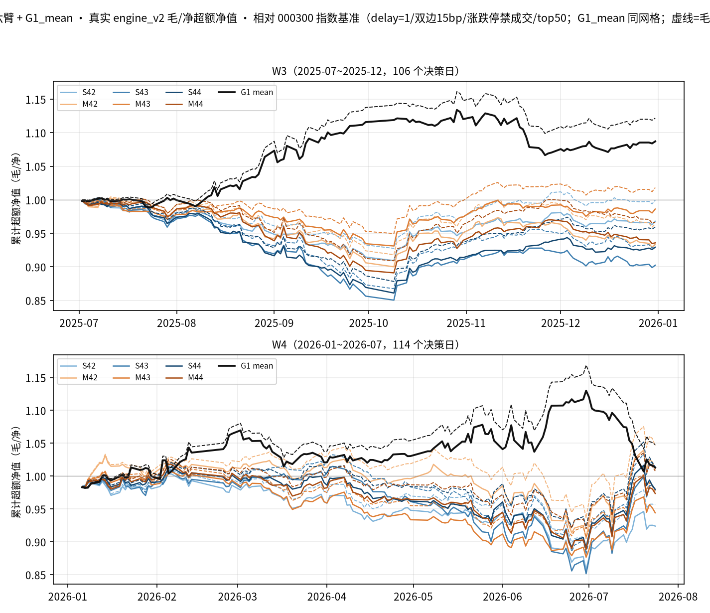
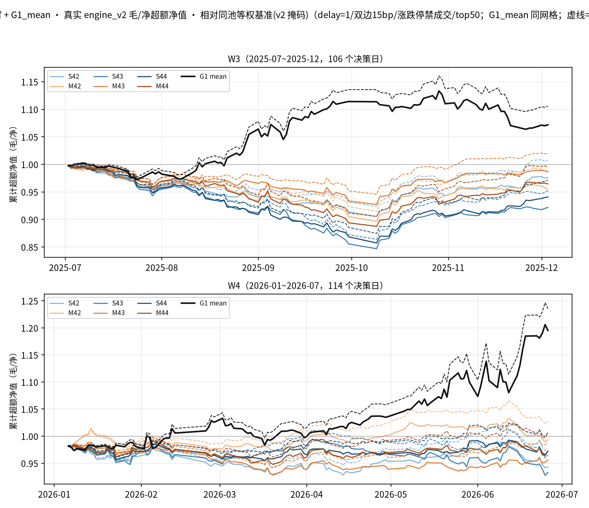

# MH1 纠偏与收益成本诊断结果（20260908）

> 执行日期：2026-09-08。计划：`docs/MH1纠偏与G10状态核对计划_20260908.md`
> （分支 `codex/mh1-correction-plan`，交接提交 `9d5128f`，基线 `4c656f5`）。
> 本轮零训练、零新推理、零 GPU；行情/信号读取上界 2026-07-24。
>
> **一句话结论：原"引擎 v2 附表/净值图"确认走的是旧引擎（元数据虚标
> delay=1），训练池确认为历史并集口径（逐日 55.1% 样本非 t 日 PIT 成员）；
> 真实 engine_v2 复算下六臂两窗净超额几乎全负（唯一正：M42@W4 idx
> +2.05%），成本复利拖累 ~3.2-4.0pp/窗——原 IC 封盘结论（delta 两窗反向、
> 判据 1/2 未触发）不受影响，"全部按协议完成"更正为不符合。**

## 0. 原错误 → 实际修复（三件事）

| # | 原错误（20260907 版） | 取证 | 修复 |
|---|---|---|---|
| 1 | `engine_attachment`/`nav.py` 经 `baseline_suite.pipeline.run_group` 实际运行**旧引擎**（`paper_replication.engine`）；JSON 手写 `delay=1` 等元数据与实际调用无关 | `tests/test_mh1_replay_corrected.py::test_old_wiring_used_old_engine`（模块身份对拍：`bp.run_portfolio is old_engine.run_portfolio`）；生产哨兵测试锁死 `run_group` 后入口仍出表 | 新 `replay_corrected.py` 直连 `engine_v2` 六接口；`engine_attachment` 改纯委托；`nav.py --corrected` 只读新重放序列画图；配置元数据由 `asdict(cfg)` 于调用点生成 |
| 2 | 训练池为 csi300 历史成分**并集**（union pkl），非原计划逐日 PIT | `pool_audit.parquet`：2567 日样本 578~737 只（均值 672.6），**非 t 日成员占比均值 55.1%** | 只取证披露，不重训不偷偷修池（见 §4） |
| 3 | 判据 4 在 `run.py` 中硬编码 `True`，非门禁真实聚合 | 源码 `cmd_evaluate`；`correction_summary.json` 记 `protocol_conformance=false` | 协议符合性更正为**不符合/有偏差**；原 `judge_summary.json` 数值不改写 |

另：计时表述修正——读出 ~58ms vs 生成式 ~13.2s 的"229×"是不同预处理边界/
计时协议（10+30 vs 1+3 次）下的两种工作负载历史参考，**不称**同等预测能力
下的精确加速；本轮未追加 GPU 计时。

## 1. 真实 engine_v2 重放（12 臂窗 + G1_mean 同网格参照）

固定真实接口：`EngineConfigV2(top_k=50, drop_n=5, min_hold=5, cost_bps=15)` 六
修正全开（delay=1 t+1 成交 t+2 起收益、双边 15bp、涨跌停禁成交、新腿不漂移、
年化 252）+ 等权基准 v2 掩码；宇宙 = 旧冻结清单并集（实测 338 列）× 完整逐日
日历（W3 126/W4 134 交易日；信号仍为原 106/114 决策日，尾日 NaN 不 ffill）。
恒等式校验：`net=gross−cost` 最大误差 **0.0**；`cost=(freed+bought_amt)×0.0015`
最大误差 5.4e-20（浮点零）。整仓对调扣 0.003、初始建仓扣 0.0015（测试锁死）。

净超额 AER（毛/净对照，指数基准 | 等权基准；ew 为稀疏共同日期口径）：

| 臂 | W3 idx 毛/净 | W3 ew 毛/净 | W4 idx 毛/净 | W4 ew 毛/净 | 成本Σ(W3/W4) | 拖累末值 |
|---|---|---|---|---|---|---|
| S42 | −0.1% / **−6.4%** | +1.8% / −5.6% | −8.2% / **−13.9%** | −5.3% / −12.2% | .0319/.0341 | .037/.032 |
| M42 | −7.1% / **−12.9%** | −3.7% / −10.7% | +8.9% / **+2.1%** | +6.2% / −1.5% | .0319/.0341 | .036/.035 |
| S43 | −13.3% / **−18.7%** | −11.3% / −17.8% | +2.6% / **−3.9%** | −7.6% / −14.4% | .0318/.0345 | .034/.034 |
| M43 | +3.7% / **−2.8%** | +4.6% / −3.0% | −4.3% / **−10.3%** | −2.5% / −9.6% | .0319/.0341 | .038/.033 |
| S44 | −8.0% / **−13.8%** | −6.8% / −13.7% | +2.7% / **−3.8%** | +1.4% / −6.0% | .0321/.0343 | .036/.034 |
| M44 | −6.7% / **−12.5%** | −1.1% / −8.3% | +1.5% / **−5.0%** | +1.3% / −6.1% | .0321/.0344 | .036/.034 |
| G1_mean（同网格） | +26.1% / **+18.3%** | +27.3% / +18.1% | +9.2% / **+2.5%** | +60.4% / +48.9%* | .0315/.0337 | .041/.034 |

描述规则（逐臂×窗×基准，局部描述非新判据；**20260908 勘误**：原文"W3 六臂
指数毛超额均非正"有误——**五臂**非正，M43 idx 毛 +3.7% 为正但净 −2.8%=
费用由正转非正）：W3 idx 五臂毛超额非正；W4 idx 三臂毛正净负
（S43/S44/M44）、M43/S42 毛负、**M42 毛+8.9%/净+2.1% 扣费后仍正**（唯一）。
G1_mean 参照两窗 idx 净超额均正。

口径披露：① ew 超额只在 v2 掩码共同有效日期比较（W3 n=105 / W4 n=113，
稀疏日期上的 252 年化会放大读数——`*`G1_mean@W4 ew AER +48.9% 的**累计**
超额仅 +19.5%，对照其 idx 累计 +1.3%；表读请以累计/毛净对照为主）；② 指数
基准超额 n=125/133（收益自 t+2 起）；③ 策略自身（非超额）毛/净累计与年化见
`replay_summary.json`（W3 自身毛 +20.8%~+43.7%、净 +13.4%~+34.8%——绝对收益
为正但跑输双基准；超额亏损≠绝对亏损）。

与旧附表的关系：旧 `engine_v2_attachment.json`/`nav_*.parquet`/两图为**旧引擎
历史产物**（如旧表 W4 ew M42 +12.61% 在 v2 下为 −1.53%），不据此说明交易
表现；数值保留不改写。

逐日序列（gross/net/cost/nav/换手/双基准收益）落
`mh1_multihorizon/data/correction_20260908/daily/{W3,W4}_{臂}.parquet`（14 份，
入 git）；**真实交易日志**（decision_date/成交日/买卖名单/freed/bought_amt/
cost/换手，全字段原生 list 可 round-trip）于 20260908 审计补证落盘
`mh1_multihorizon/data/grid_audit_20260908/transactions/`（14 份，与本文逐日
净收益逐位对拍 max|Δ|=0.0；原版本未保存逐笔日志，本文数值不变）。

## 2. 成本分解读法（同一路径；20260908 措辞勘误）

- **成本合计 Σcost ≈ 0.032-0.034 是日成本率的算术和**（≈ 单边 15bp ×
  双边换手额的逐日累加），**不是复利量**；复利口径的量是毛/净净值拖累
  末值（`gross_nav − net_nav`）0.032-0.041——两者数值接近但语义不同，
  勿混用（原版本把 Σcost 括注为"复利累计"有误）；
- W3 五臂**毛超额已 ≤0**（费用不是唯一原因，读出信号本身无超额；例外
  M43 idx 毛 +3.7%）；W4 有四臂 idx/ew 出现"毛>0 → 净≤0"（费用由正转
  非正）；
- 成本值大 ≠ 已证明它是表现弱的唯一原因（M42@W4 扣费后仍正即为反例）。

## 3. 训练池偏差取证（任务 D）

`pool_audit.parquet`（2567 日逐日）：原训练样本 578~737 只/日（均值 672.6，
与计划所述一致），**t 日 PIT 成员样本占比均值 44.9%（非成员 55.1%）**。验
证/评价段仍为 t 日 PIT——即训练-评价存在池口径不一致。两臂共享同一训练数据，
配对差（delta）的参考价值保留；但**原"逐日 PIT 训练"命题未严格完成**，
`correction_summary.json` 记 `protocol_conformance=false`。原 IC 数字、判据
定义、模型、预算均未改写；无新模型输出即不声称"重新验证预测效果"。

对未来严格 PIT 重跑：只列前提不执行——修训练筛选（逐日 t 日成员）属新一次
纠偏重跑（需重训六臂 ~3.3h GPU + 重评），成本与授权另议；本轮不悄悄替换
已有模型。

## 4. 测试与验证

- `pytest tests/test_mh1_replay_corrected.py tests/test_engine_v2.py -q` →
  **23 passed**（新增 7 项先失败后通过：旧引擎取证/生产哨兵+合成 fetcher+v2
  直调捕获/delay-双边-涨跌停/恒等式与费用公式/CLI 拒绝条件/日历与 NaN/证据
  哈希防篡改）；
- 回归：`tests/test_mh1_multihorizon.py`（除依赖 G1 权重的 1 项外 15 passed；
  权重项在主工作树用原权重通过）；
- 证据保全：preflight 51 件哈希入档，replay 结束逐项不变（含原信号/ckpt/
  判读/净值/日志/宇宙清单）；`git diff --check` 通过；无训练入口/模型载入/
  forward 读取进入重放调用链（fetch 上界 2026-07-24，CLI 拒绝越界参数）。

## 5. 剩余限制

- 等权基准超额的稀疏日期年化披露见 §1（累计口径为佳）；尾部 20 日无信号期
  持仓至窗口末（引擎既有行为，未造强平规则）；
- 本轮不重训、不改 IC 判据、不读 forward（≥2026-07-25）、不启动 G10；
- 生成式 vs 读出计时为历史参考值，未按同等协议复测。

## 6. 产物清单

`mh1_multihorizon/data/correction_20260908/`：`manifest_before.json`（51 件
证据哈希）、`replay_summary.json`（14 臂窗 + 恒等式校验）、
`pool_audit_summary.json` + `pool_audit.parquet`、`correction_summary.json`、
`daily/` 14 份逐日序列；图 `docs/images/mh1_nav_v2_{idx,ew}.png`；日志
`data/logs/correction_*.log`。G10 状态另见 `docs/G10状态核对_20260908.md`。
