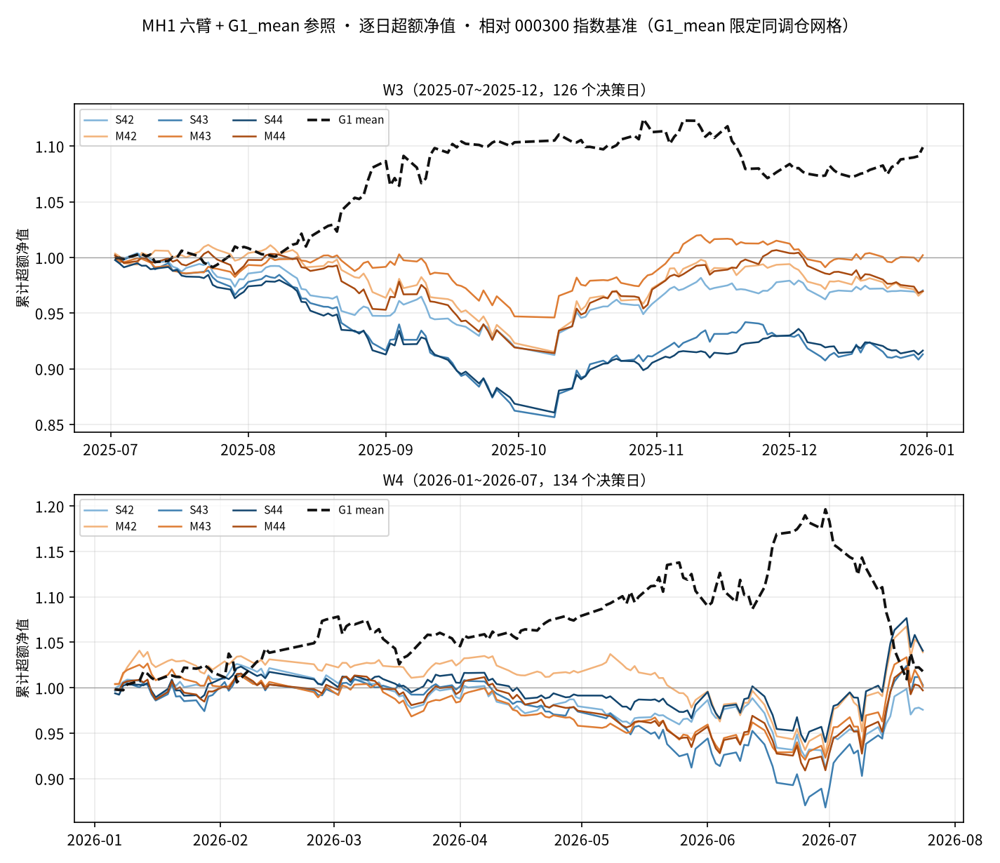
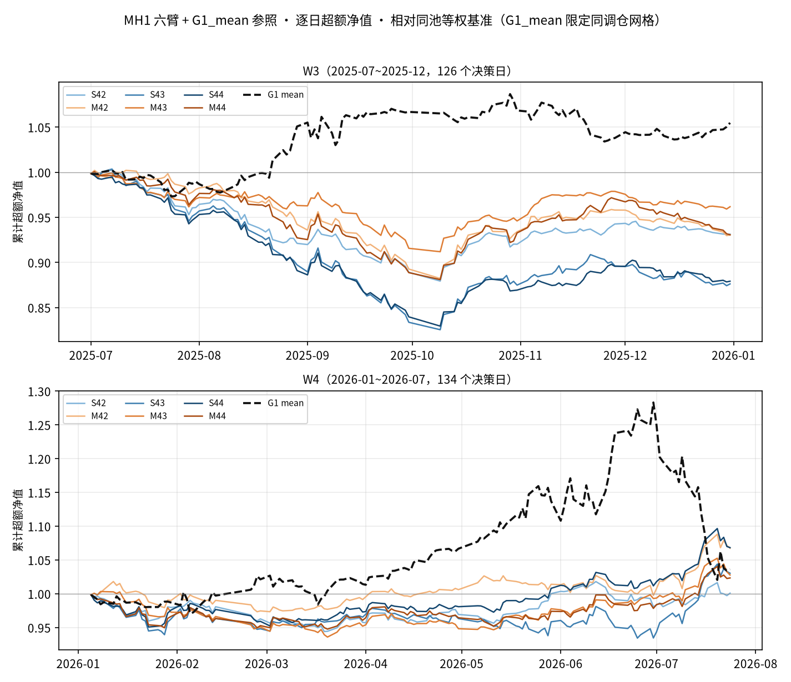

# MH1 多期限监督实验（TimesFM 启发）· 结果与一次封盘判读

> 执行日期：2026-09-07。计划：`docs/TimesFM多期限监督实验计划_20260907.md`
> （分支 `codex/timesfm-multihorizon`，交接提交 e908fd1）。
> 协议冻结：`mh1_multihorizon/data/protocol.json`
> （SHA256 `2516998a2106fa8b2630b27bb34cf6742b70c3c6e8e33b564b46b4e28297f9ff`，
> preflight 14:48 落盘，训练开始后零改动）。
>
> **一句话结论：判据 1/2 未触发——多期限辅助监督（M）相对单期限对照（S）
> 无稳健 10 日截面 RankIC 增益：差值 delta 在 W3 为正（+0.021，t+1.5）但
> W4 转负（−0.008，t−0.8），合并分段 HAC t=+0.67；按预注册封盘
> "本协议下未支持多期限辅助监督带来稳健增益"，不扩大为"所有多期限方法
> 无效"，不注册前向验证。**

## 0. 执行记录与披露

| 事项 | 记录 |
|---|---|
| 环境 | conda quant（Python 3.13.14 / torch 2.13.0+cu130 / RTX 5090 32GB，FP32，TF32 matmul=False cudnn=True，determinism 关） |
| 门禁测试 | `pytest tests/test_mh1_multihorizon.py` 16 项契约全过（标签日历定位/20日跨段剔除/无前视归一化/PIT 只看 t 日成员/S-M 同批/128 下限/W3W4 封存上界/梯度掩蔽/底座冻结/选点只读 10 日/IC code 对齐/缺失不填零/分段 HAC 对齐 `_nw_tvalue`） |
| 协议 | preflight 14:44~14:48；训练段 2567 日 / 1,726,535 样本（决策 2014-05-19~2024-12-03，+20 终点 ≤ 2024-12-31）；验证段 97 日（2025-01-02~2025-05-30）；W3 106 日（2025-07-01~2025-12-03）；W4 114 日（2026-01-05~2026-06-26） |
| smoke | S42/M42 各 2 批：S/M init_hash 对拍一致；0.2s/2 步 → 外推 5.41h ≤ 12h 预算；峰值显存 0.91GB |
| 训练 | 14:53~18:37（六臂顺序 S42,M42,S43,M43,S44,M44），每臂 15×2000 更新无早停，GPU 实计 3.31h；S/M 同种子初始化哈希 3/3 一致；退化截面跳过批 = 0 |
| 16:30 登记守卫 | cron `30 16 * * 1-5 run_registry`（历史证据用 GPU，08-20 OOM）；守卫窗 16:25~16:45 于 S43 e12 边界触发（16:27 卸载底座，等待 18min，16:45 回载）；当日登记任务 16:30:04~16:31:52 正常完成（298 股，无 OOM） |
| 评估 | evaluate 21:12~21:26 一次开封（前三次启动在收尾 digest/计时入参上连续修复后全绿，判读数字只来自最终完整轮）；信号 W3 187,974 行（106 日 × ≤301 股）/ W4 201,744 行（114 日 × ≤319 股），无重复键、无 forward 日期、六模型齐全 |
| 数据源口径 | 训练 = csi300 union pkl（G1 同源，H1a 同口径，受限 Unpickler，SHA256 入协议）；验证/W3/W4 = qlib PIT csi300 t 日成员（H1 早停/打分同口径，`tradestatuscode==0` 停牌剔除语义照抄——已知取值域 -1/0/2/4 的局限随 H1 披露） |
| 底座 | G1 s100（seed=100 证据：`finetune_suite/config.py:87` + `docs/扩语料微调实验结果_20260815.md`）；tokenizer SHA256 `5ca43492…`（前 16）、predictor `4f238213…`，d_model=832，全参数冻结逐值不变（契约测试） |

## 1. 训练曲线（六臂 × 15 epochs 固定预算；选点 = 验证段 10 日 RankIC 最大 epoch，并列最早）

| 臂 | 逐 epoch val_main（★=最佳） | 最佳 | 用时 |
|---|---|---|---|
| S42 | −0.005 +0.027 +0.023 +0.036 +0.008 +0.027 +0.059 +0.045 +0.061 +0.061 **+0.076★** +0.039 +0.049 +0.065 +0.040 | e11 +0.076 | 32.9min |
| M42 | −0.009 +0.017 +0.039 +0.025 −0.000 +0.026 +0.068 +0.057 +0.076 **+0.080★** +0.063 +0.031 +0.046 +0.056 +0.035 | e10 +0.080 | 33.0min |
| S43 | −0.006 +0.017 +0.062 +0.039 +0.015 +0.047 +0.043 **+0.085★** +0.049 +0.022 +0.085 +0.037 +0.076 +0.025 +0.044 | e8 +0.085（与 e11 并列取早） | 32.9min |
| M43 | −0.011 +0.026 +0.053 +0.020 +0.021 +0.033 +0.040 +0.073 +0.048 +0.011 +0.068 +0.034 **+0.081★** +0.016 +0.035 | e13 +0.081 | 33.1min |
| S44 | +0.032 +0.060 +0.045 +0.001 +0.022 +0.013 +0.046 +0.024 +0.065 +0.036 **+0.092★** +0.084 +0.066 +0.037 +0.066 | e11 +0.092 | 32.9min |
| M44 | +0.029 +0.060 +0.031 −0.004 +0.016 +0.022 +0.031 +0.046 +0.055 +0.026 **+0.081★** +0.072 +0.062 +0.026 +0.069 | e11 +0.081 | 33.7min |

曲线形态：两臂都在 e8~e13 段到峰，无 G9 式"e1 即峰"；同种子 M/S 曲线
互有高低（s42 M 略优、s43 S 略优、s44 S 略优）——验证段本身已提示
配对差方向不稳定。

## 2. 主表：M−S 配对 10 日截面 RankIC（§6 唯一主检验，三种子共同有效日期）

| 序列 | 窗 | n | 均值 | NW(lag=9) t |
|---|---|---|---|---|
| delta = mean_seed(IC_M − IC_S) | W3 | 106 | **+0.0212** | +1.53 |
| delta | W4 | 114 | **−0.0081** | −0.82 |
| delta | 合并分段 HAC | 220 | +0.0060 | **+0.67** |
| M 三种子日均 IC | W3 | 106 | +0.0265 | +0.70 |
| M 三种子日均 IC | W4 | 114 | +0.0614 | +2.62 |
| M 三种子日均 IC | 合并分段 HAC | 220 | +0.0446 | +1.998 |
| S 三种子日均 IC（附） | W3 | 106 | +0.0053 | — |
| S 三种子日均 IC（附） | W4 | 114 | +0.0695 | — |

表读：**delta 两窗反向**（W3 M 优、W4 S 优），合并 t 仅 +0.67；M 自身
IC 呈 H1 同款"窗口态"——W4 强（t+2.62）而 W3 弱（t+0.70），合并 t
+1.998 恰在线下。W4 里 S（+0.069）与 M（+0.061）同样强：2026 窗的
截面信息来自底座读出本身，不来自多期限监督。

## 3. 判据（一次开封）

| 判据 | 定义 | 结果 |
|---|---|---|
| 1 | M 三种子日均 10 日 IC 两窗均 >0 且合并 NW t>2 | **✗**（两窗为正但 W3 t=+0.70，合并 t=+1.998<2） |
| 2 | delta_t 两窗均值均 >0 且合并 NW t>2 | **✗**（W4 均值 −0.0081<0，合并 t=+0.67） |
| 3 | ≥2 种子 M−S 两窗均为正 | ✓（s43/s44；s42 W4 为负） |
| 4 | 门禁全部通过（协议/测试/六训练按协议完成） | ✓ |

**筛选判定：未通过 → 按预注册封盘"本协议下未支持多期限辅助监督带来稳健
增益"。** 不自动注册新臂、不改在位策略、不读 forward；不扩大为"所有
多期限方法无效"；本轮为已观察历史上的配对探索，即便个别数字过线也不
构成样本外声明。

## 4. 单种子附表与 M 各期限描述性诊断

每种子 delta 两窗均值（10 日主期限）：

| 种子 | W3 | W4 |
|---|---|---|
| s42 | +0.0316 | −0.0361 |
| s43 | +0.0195 | +0.0080 |
| s44 | +0.0126 | +0.0037 |

M 各期限三种子日均 IC（只作诊断，不挑最好期限判成功；S 未受训辅助输出
不评价；n≈106/114，NW 为窗内位置距离口径）：

| 期限 | W3 均值 (t) | W4 均值 (t) |
|---|---|---|
| h1 | +0.0300 (+2.02) | +0.0386 (+3.98) |
| h5 | +0.0202 (+0.73) | +0.0436 (+2.60) |
| h10 | +0.0265 (+0.70) | +0.0614 (+2.62) |
| h20 | −0.0021 (−0.05) | +0.0874 (+3.02) |

诊断读法：W4 各期限 IC 随期限单调走强（h20 达 +0.087）——与 H1/G1 参照
同窗同向，再次指向"2026 窗奖励一切读出信号"的窗口态而非监督增益；
W3 除 h1 外全弱。h1 在两窗同正（+0.030/+0.039）是唯一跨窗稳定的描述性
例外，但**不得**据此改判（判据冻结于 k=10）。

## 5. 参照行（本轮同日期/同股票/同标签重算；非 S/M 因果对照）

| 参照 | W3 10日 IC (NW t, n) | W4 10日 IC (NW t, n) |
|---|---|---|
| G1_mean（在位者） | +0.0183 (+0.8, 106) | +0.0641 (+2.7, 114) |
| H1a-lin_s42 | +0.0043 (+0.1, 106) | +0.0367 (+1.2, 114) |
| H1a-kda_s42 | +0.0124 (+0.3, 106) | +0.0666 (+2.4, 114) |

参照与本轮 M/S 在 W4 同量级（+0.037~+0.069）、W3 同弱——多期限监督
既没超过免费基线，也没落在 H1 族之外。

## 6. 引擎 v2 附表（描述性，不进判据；delay=1/单边 15bp/涨跌停禁成交/top50/drop5/min_hold5，宇宙=H1 冻结口径轮次并集 338 列，双基准 AER）

| 臂 | W3 ew / idx | W4 ew / idx | 日均换手 | W4 MDD |
|---|---|---|---|---|
| S42 | −12.86% / −5.68% | +0.16% / −4.40% | ~8.9% | −5.4% |
| M42 | −13.00% / −5.90% | +12.61% / +7.27% | ~8.9% | −4.4% |
| S43 | −22.58% / −16.27% | +5.60% / +0.55% | ~8.9% | −6.4% |
| M43 | −7.26% / +0.40% | +5.12% / +0.26% | ~8.9% | −6.7% |
| S44 | −22.07% / −15.67% | +12.78% / +7.60% | ~9.0% | −4.8% |
| M44 | −12.99% / −5.82% | +4.30% / −0.53% | ~9.0% | −5.1% |

引擎层与 IC 层一致：W3 六臂扣费全深负（换手 ~9%/日 × 15bp 把弱 IC 吃穿），
W4 分化。beta_gap：W3 −4.7pp / W4 +2.2pp（等权-指数基准差）。

**逐日超额净值（20260907 追加，同一引擎配置逐位复跑，六臂 AER 与上表
一致 + beta_gap/宇宙对拍通过）**——六臂 + G1_mean 参照（黑虚线，限定到
与 MH1 相同的 W3/W4 调仓网格、同节奏交易；其 W3 idx +20.2%/ew +10.9%、
W4 idx +3.4%/ew +6.7%，与 H1 文档冻结的全网格在位者数字网格不同、不可
直接比较）：

图读（描述性）：W3 两基准下六臂净值单调下沉、G1_mean 同网格参照逆势
上行——2025H2 的窗口态对读出头与在位者方向相反；W4 六臂与 G1_mean 同
向小幅上行，M/S 两族彼此交错（净值维度同样无 M 稳健优势）。逐日序列
（1+excess 累乘，14 列 = 7 系 × 2 基准）落
`mh1_multihorizon/data/nav_{W3,W4}.parquet`（126/134 个交易日格，
含决策日间持仓段）。

## 7. 计时与显存（同机同批 128 股输入，FP32；10 warmup + 30 计时，GPU 前后 synchronize）

| 路径 | p50 | p95 | 峰值显存 |
|---|---|---|---|
| S42 完整历史→分数（backbone.extract+头） | 57.7ms | 57.9ms | 0.88GB |
| M42 完整历史→分数 | 57.8ms | 57.9ms | 0.88GB |
| S42 已有 hidden→分数 | 0.04ms | 0.04ms | 0.47GB |
| M42 已有 hidden→分数 | 0.04ms | 0.04ms | 0.47GB |
| G1 生成式参照（pred_len=10, N=20, T=1.0, top_p=0.9，端到端含内部预处理；1 warmup + 3 计时，128 股全保留） | 13.19s | 13.21s | 12.93GB |

读出路径比 G1 生成式快 ~229×（57.7ms vs 13.2s / 128 股）、显存 ~15×
低；S/M 头同构耗时无差（符合预期，M 不更快）。生成式参照为缩减协议
（3 次），量级可比、非逐位对比。

## 8. 偏差与限制

- 本轮为已观察历史上的配对探索；delta 两窗反向 + 合并 t≪2，结论限于
  "本协议（G1 冻结底座 + 共享 MLP 四期限头 + 等权 IC 损失）"；
- 15 epochs 固定预算与 H1 的 patience=5 不同（两臂同时变更）；MH1 与 H1
  数字不可直接相减归因；
- `tradestatuscode==0` 停牌判定沿用 H1 口径（已知漏 2/4 码）；qlib 侧
  引擎可交易掩码用 `==-1`（引擎自身口径），两处口径差异随引擎披露；
- W3/W4 因 20 日标签边界裁剪（106/114 日 < H1 的 126/134），统计不可与
  旧表直接比较；M 各期限诊断的 NW 用窗内位置距离（缺档少，披露口径）；
- evaluate 前三次启动在收尾环节连续修复（digest 嵌套迭代、计时假日空窗、
  生成式时间戳类型），判读数字全部来自最终完整轮（judge_summary.json
  单次开封，与逐日信号可复算一致）；协议/训练零改动。

## 9. 产物清单

- 协议/清单：`mh1_multihorizon/data/protocol.json`（+`.sha256`）、`manifest.json`、`stage_state.json`
- checkpoint：`data/run_{S,M}{42,43,44}_best.pt`（只含新头+优化器/进度，底座哈希引用）+ `ckpt/` 续跑态、`data/run_*_history.json` ×6
- 信号：`data/signals_{W3,W4}.parquet`（date/instrument/arm/seed/h1..h20/score/协议哈希）
- 判读：`data/judge_summary.json`（主表+判据+参照）、`data/engine_v2_attachment.json`、`data/timing.json`、`data/gpu_budget.json`
- 净值（20260907 追加）：`data/nav_{W3,W4}.parquet` + 图 `docs/images/mh1_nav_{idx,ew}.png`（`mh1_multihorizon/nav.py` 同引擎配置复跑）
- 日志：`data/logs/{preflight,smoke,train,evaluate}.log`
- 代码与测试：`mh1_multihorizon/`（7 文件）+ `tests/test_mh1_multihorizon.py`（16 契约）
- 提交：见 `git log`（本分支 `codex/timesfm-multihorizon`，不 merge 不 push）
