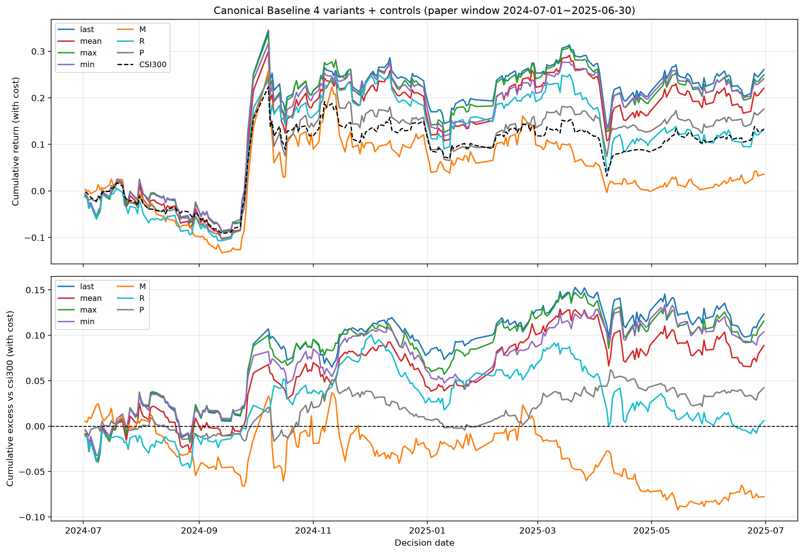
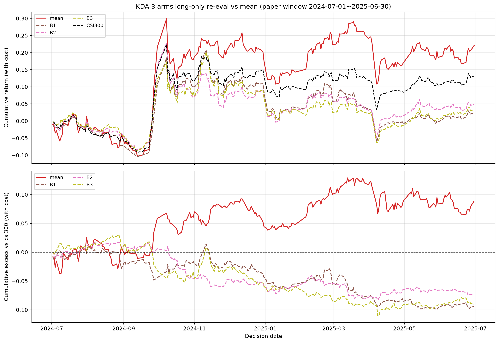
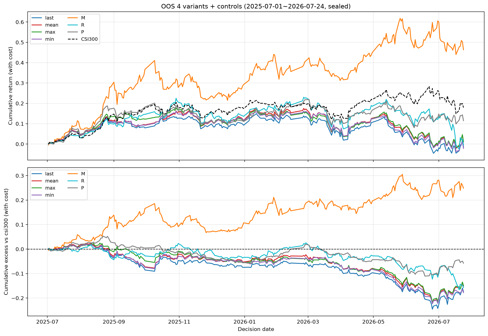
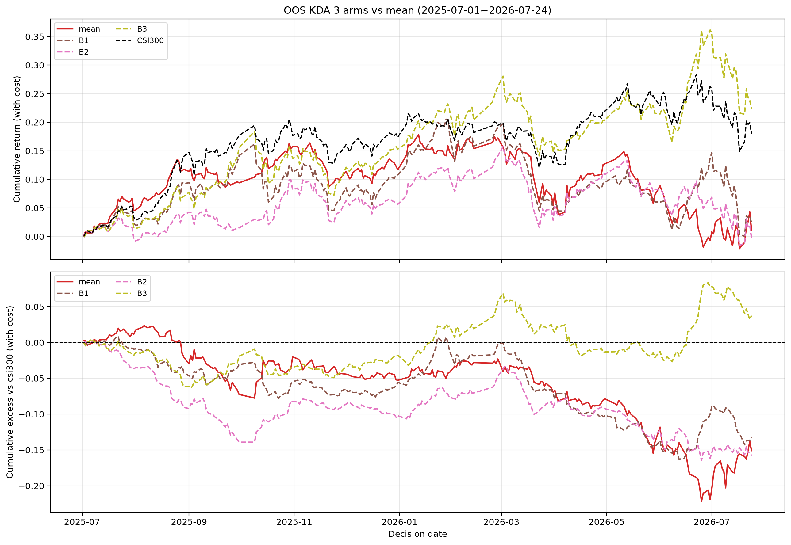

# Canonical Baseline 确立 + KDA long-only 重评 + 真样本外延展 · 结果

> 日期：2026-08-10
> 分支：`feature/baseline-and-oos`（从 `feature/paper-replication` 切出）
> 计划：`docs/基准与样本外测试计划_20260810.md`
> 解释器：`/home/user/miniconda3/envs/quant/bin/python`
> 引擎：复用 `paper_replication/engine.py`（top-k/drop-n long-only）+ 双基准（csi300 指数 + 同池等权）
> 配置：`paper_replication/config.yaml`（N=20, T=1.0, top_p=0.9, L=90/H=10, k=50/n=5/min_hold=5/单边15bp）

## 核心结论（先读这段）

1. **canonical baseline 确立**：论文窗口四变体（last/mean/max/min，全部除以现价）落地，
   mean 对拍门禁**逐位通过**（与既有 K 组 max|Δ|=0.000e+00，71345 单元）。canonical 主线
   永远是 mean，无论四变体谁强。
2. **样本外预注册判定——主判据失败**：mean 样本外 AER(等权) **-15.10%**、AER(指数) **-14.29%**，
   均 ≤0。按计划 §4 判据 3："**论文窗口的正结果不能外推，疑似窗口运气**，如实记录，
   **不做任何参数搜索**"。这是本轮最重要的判定，已封盘。
3. 四变体在样本外**全部塌方**（AER 均在 -14%~-17%），IR 全为负（强度塌方）。
4. KDA 三臂 long-only 重评：论文窗口全负（记录立场），样本外 B3 意外 +3.53%——但按 §3
   纪律标注"待样本外验证"非"有效"，且不触发重训。

## §1 Canonical Baseline 定义（定死后不再动）

- **模型**：Kronos-base（zero-shot，官方权重，不微调）；
- **信号族**：四变体，**全部除以现价**（修正上游 demo `qlib_test.py` 的价格尺度偏差）：
  - `last = pred_close[t+H]/close_t − 1`
  - `mean = mean(pred_close[t+1..t+H])/close_t − 1`（**canonical 主线 = 既有 K 组**）
  - `max = max(...)/close_t − 1`
  - `min = min(...)/close_t − 1`
- **推理**：N=20，`T=1.0, top_p=0.9, top_k=0`，seed=42，L=90/H=10；
- **组合**：`paper_replication/engine.py`，k=50 / n=5 / min_hold=5 / 单边 15bp，csi300 point-in-time；
- **双基准**：`000300.SH` 指数（对外口径）+ 同池等权（选股 alpha / 门禁）。

## §2 阶段 1：Baseline 四变体落地（论文窗口 2024-07-01~2025-06-30，242 日）

### 2.1 mean 对拍门禁（§2.2，最重要）

新跑的 mean 信号与既有 `paper_replication/data/daily_signals_K.parquet` 逐位对拍：

| 项 | 值 |
|---|---|
| 公共日期 | 242 / 新 242 / 既有 242 |
| 公共列 | 324 / 新 336 / 既有 324（变体含 OOS 期股票列，对拍取交集） |
| 有效单元 | 71345 |
| **max\|Δ\|** | **0.000e+00** |
| \|Δ\|>1e-8 单元 | 0 |
| NaN 不一致 | 0 |

**✓ 对拍门禁通过**：mean 与既有 K 组逐位一致，证明推理路径同 seed 同 N 完全可复现。

### 2.2 论文窗口四变体 + 对照 + KDA 三臂双基准表

beta_gap = -4.39%（指数累计 − 等权累计，结构性等权-beta 溢价）。

| 组 | AER(指数) | IR(指数) | AER(等权) | IR(等权) | MDD | 日均换手 |
|---|---|---|---|---|---|---|
| **last** | +12.52% | +1.043 | +7.83% | +0.842 | -5.28% | 10.32% |
| **mean** | +8.99% | +0.783 | +4.47% | +0.519 | -5.62% | 10.24% | ← canonical
| **max** | +11.71% | +0.979 | +7.10% | +0.796 | -5.36% | 10.33% |
| **min** | +10.52% | +0.991 | +5.87% | +0.724 | -5.92% | 10.26% |
| M（10日动量） | -7.86% | -0.464 | -11.69% | -0.834 | -12.44% | 9.96% |
| R（10日反转） | +0.63% | +0.112 | -3.63% | -0.329 | -9.89% | 10.39% |
| P（随机占位） | +4.29% | +0.610 | **-0.14%** | -0.006 | -5.26% | 10.19% | ← 门禁通过
| B1（KDA 纯监督） | -9.57% | -1.268 | -13.52% | -1.762 | -11.20% | 10.05% |
| B2（冻结 Kronos+linear） | -7.59% | -1.329 | -11.63% | -1.924 | -10.06% | 10.21% |
| B3（冻结 Kronos+KDA头） | -9.20% | -1.189 | -13.23% | -1.529 | -13.67% | 10.22% |

**判读**：
- canonical mean 完美复现既有 K 组（+8.99%/0.783，与 paper_replication 一致）；
- 四变体均击败 M/R；P 组 AER(等权) -0.14% < +3% **门禁通过**（引擎不制造 alpha）；
- **min 未显著强于 mean**（AER(等权) 差 +1.40pp < 3pp 阈值），不构成候选发现。

### 2.3 图1 式双图（论文窗口）

- 
- 

## §3 阶段 2：KDA 三臂 long-only 重评（对照记录，无翻案门槛）

**预注册立场（§3）**：这是换评估口径的补测（多空 → long-only），不是翻案。三臂的
RankIC（0.0075 以下）预期跑不过 baseline mean；结果无论好坏只做记录，不触发任何重训/调参。

**论文窗口结果**（见 §2.2 末三行）：三臂 AER(指数) 全负（-7.59%~-9.57%），均不超过 mean
（+8.99%），无"待样本外验证"标注。与 §3 预期一致——KDA 头在 long-only 口径下不敌 zero-shot baseline。

## §4 阶段 3：真样本外延展（本轮最重要的判定）

### 4.1 窗口边界调整（如实记录）

计划 §4 原写样本外窗口 2025-07-01~2026-07-31，但 2026-07-31 之后仅 5 个交易日
（数据末日 2026-08-07），不足 H=10 的信号结算窗口——每个决策日 t 需 t+1..t+H 个交易日
存在。最后一个完整决策日是 2026-07-24（其后恰好 10 个交易日 2026-07-27~2026-08-07）。

**窗口末日改为 2026-07-24**，保留 H=10 完整结算口径、与论文窗口同口径、无信号缺失。
运行前断言：2026-07-24 + H=10 结算日 = 2026-08-07 ≤ 数据末日 2026-08-07 ✓。

### 4.2 样本外四变体 + 对照 + KDA 表（2025-07-01~2026-07-24，260 日，封盘）

beta_gap = -1.84%（样本外等权-beta 溢价显著小于论文窗口的 -4.39%）。

| 组 | AER(指数) | IR(指数) | AER(等权) | IR(等权) | MDD | 日均换手 |
|---|---|---|---|---|---|---|
| **last** | -16.48% | -1.260 | -17.25% | -1.811 | -26.01% | 10.18% |
| **mean** | **-14.29%** | **-1.121** | **-15.10%** | **-1.682** | -23.99% | 10.24% | ← 主判据
| **max** | -14.11% | -1.152 | -14.94% | -1.766 | -23.74% | 10.15% |
| **min** | -16.88% | -1.386 | -17.70% | -1.960 | -23.79% | 10.23% |
| M（10日动量） | +23.28% | +1.346 | +21.40% | +1.234 | -9.99% | 9.76% |
| R（10日反转） | -14.90% | -1.252 | -15.98% | -1.424 | -18.70% | 10.24% |
| P（随机占位） | -5.44% | -0.616 | -6.53% | -1.248 | -15.49% | 10.18% | ← 门禁通过
| B1 | -12.53% | -1.376 | -13.74% | -1.436 | -16.99% | 10.16% |
| B2 | -14.97% | -1.759 | -16.04% | -2.090 | -16.60% | 10.28% |
| B3 | +3.53% | +0.417 | +1.97% | +0.238 | -8.95% | 10.26% |

### 4.3 预注册判定（§4，跑前冻结，跑完封盘）

| 判据 | 结果 | 说明 |
|---|---|---|
| 引擎门禁 | ✅ 通过 | P 组 AER(等权) -6.53% < +3%（负值是成本拖，非 bug） |
| **判据1 主判据** | ❌ **失败** | mean AER(等权) -15.10% ≤ 0 **且** AER(指数) -14.29% ≤ 0 |
| 判据2 强度 | ❌ 塌方 | IR(指数) -1.121（负值，非"方向存活强度衰减"） |
| 判据3（隐含） | 命中 | 论文窗口正结果不能外推，疑似窗口运气 |
| 判据4 min候选 | ❌ 不构成 | min 两段都没显著强于 mean（论文窗 +1.40pp / 样本外 -2.60pp，均 <3pp） |

**总判定：论文窗口的正结果不能外推，疑似窗口运气。封盘，不做任何参数搜索。**

### 4.4 图1 式双图（样本外）

- 
- 

## §5 探索性观察（非预注册，仅记录，不触发行动）

以下观察**不在预注册判据内**，按 §6 纪律仅作记录，不据此改 canonical、不重训、不调参：

1. **动量 M 组样本外反转**：论文窗口 -7.86%，样本外 +23.28%（AER 指数）。这是样本外
   市场风格切换的体现——但 M 是免费基线，非本计划主线，记录供后续独立立项。
2. **KDA B3 样本外转正**：论文窗口 -9.20%，样本外 +3.53%（唯一转正的改造臂）。按 §3
   纪律标注"待样本外验证"非"有效"，且不触发重训。B3 的 long-only 表现与 cross_section
   口径（final 段 RankIC +0.0062）方向一致，但单段样本不足以结论。
3. **min vs mean**：两段 min 都没显著强于 mean，不构成"预测路径下界含风险信息"的候选发现。

## §6 纪律遵守

- ✅ canonical = mean 在本计划内未变更；四变体是预注册族，未事后挑最好的当主线；
- ✅ 样本外窗口数字在四变体 + 三对照 + KDA 全部定型后才查看；跑完一次封盘；
- ✅ KDA 臂结果未触发重训；未改 `paper_replication/`、`cross_section*/`、`kronos_qlib/` 既有文件；
- ✅ 判读措辞区分"样本内（论文窗口）/ 样本外"，所有表格标注窗口；
- ✅ 样本外主判据失败后，**未做任何参数搜索**（封盘）。

## §7 复现指引

```
# 论文窗口四变体（断点续跑，~2h）
python -m baseline_suite.run_signals variants --window paper
python -m baseline_suite.run_signals baselines --window paper
python -m baseline_suite.run_signals gate --window paper   # mean 对拍门禁

# 样本外四变体（~2.2h）
python -m baseline_suite.run_signals variants --window oos
python -m baseline_suite.run_signals baselines --window oos

# 回测 + 判读 + 图
python -m baseline_suite.run_backtest paper   # 阶段1+2
python -m baseline_suite.run_backtest oos     # 阶段3 预注册判定
```

产出：`baseline_suite/data/results_{paper,oos}.json` + `baseline_suite/figures/fig_{paper,oos}_*.png`。
信号 parquet 不入库（.gitignore），指标 JSON + png 图入库。
