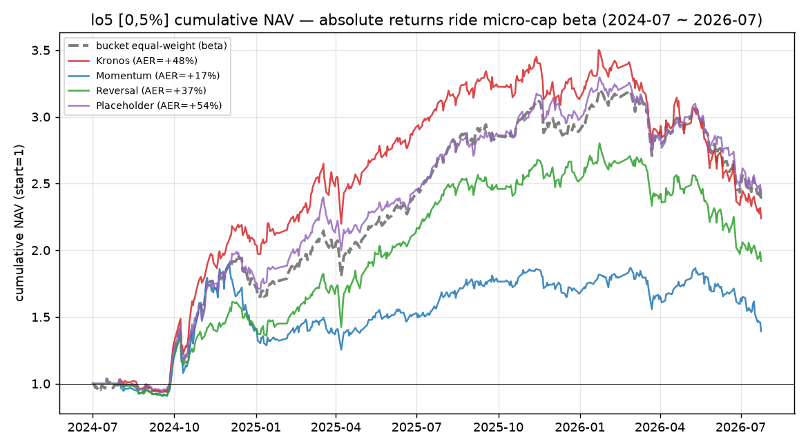
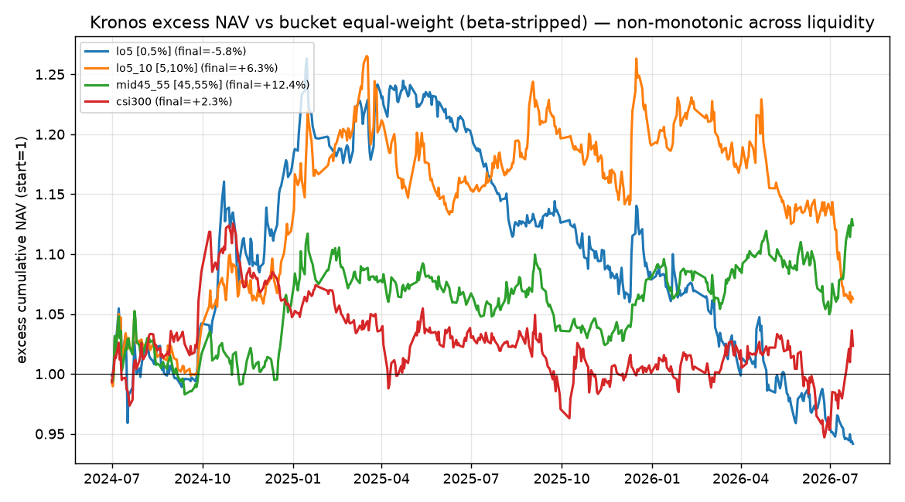
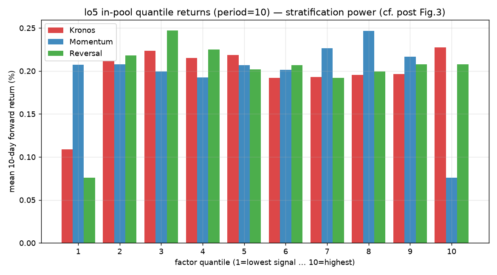
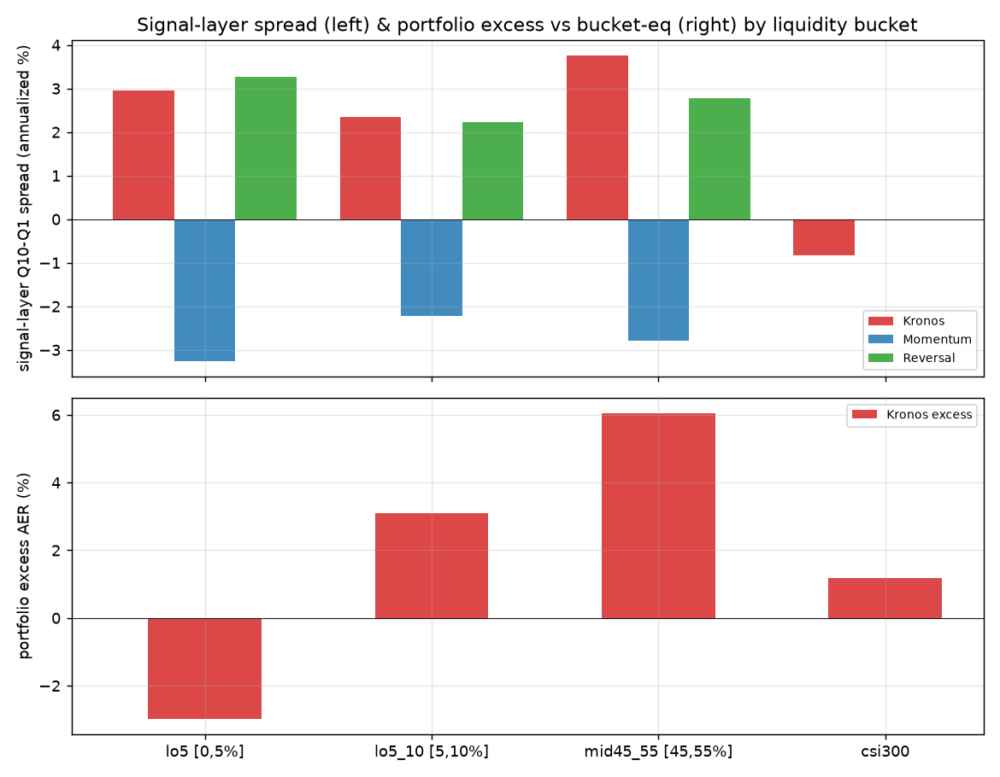

# 流动性分层检验 · 图文报告

> 审判小红书帖"Kronos 低流动性分层预测更准"｜2026-08-12｜分支 `feature/liquidity-stratified`
> 技术明细见 [`流动性分层检验结果_20260812.md`](流动性分层检验结果_20260812.md)；
> 原始指标见 `liquidity_strat/data/{analysis_signal_layer,analysis_portfolio_layer,judgements}.json`。

## 结论先行

补齐帖子三硬伤（**无基准 / 预训练泄漏 / 无成本涨跌停**）、隔离到预训练截止后（2024-07~2026-07，502 交易日）后：

> **"流动性越低越准"不成立。** 最低档看似惊艳的净值是微盘 beta；剥离后池内分层区分力虽真实，却归于微盘反转、Kronos 无增量，且执行上不可收割。

| 预注册判读 | 结果 | 一句话 |
|---|:---:|---|
| ① 门禁 | ✅ | 随机占位 P 组对档等权超额 +0.28%，管线无 bug |
| ② 信号存在 | ✅ | lo5 Kronos 10 分位 spread 年化 +2.95%（t=2.60） |
| ③ 相对反转 | ❌ | Kronos +2.95% **不及** 10 日反转 +3.27% |
| ④ 单调性 | ◐ | 中位档超额最高，最低档为负，"越低越准"方向反了 |
| ⑤ 经济性 | ❌ | lo5 扣费后对档等权超额 **-2.97%** |

---

## 图一：最低档净值是 beta，不是 alpha

**读图**：lo5 [0,5%] 档里，Kronos / 动量 / 反转 / 随机占位四条策略线**全部紧贴**本档等权基准（灰虚线）上行——
随机占位 P 甚至拿到**最高**净值。这说明无论怎么选股，搭的都是 2024-2026 微盘普涨的 beta。
绝对 AER 看着惊人（Kronos +49.9%），但 P 占位 +56.0%——**净值量级与模型能力无关**。
这正是帖子图一/图二（最低档 ~3.5×）的真相：剥不掉 beta 的"简单回测"。

---

## 图二：剥离 beta 后，"越低越准"反而越低越差

**读图**：把每档组合收益减去**同档等权基准**后，四档 Kronos 超额净值（start=1）：
**lo5 最低（终值水下）、mid45_55 最高**。流动性从低到高，超额并非单调递减，而是**先升后降**——
与帖子主张方向相反。最低流动性档在剥离 beta + 加成本后**没有可实现的选股超额**。

> 注：图为累计超额净值（cumprod），与结果文档的年化超额（empyrical annual_return）口径不同但定性一致。

---

## 图三：池内分层区分力真实存在（帖子图三的可信部分）

**读图**：lo5 档内按信号分 10 层，period=10 的平均远期收益。Kronos（红）与反转 R（绿）
呈现 Q1→Q10 的正斜率（**分层区分力存活**，对应帖子图三），动量 M（蓝）则反向（微盘动量反转）。
但红绿几乎镜像、量级接近——**Kronos 的区分力与"负动量=反转"同源**，并非独立增量。判读 ③ 据此判负。

---

## 图四：跨档 spread 与超额均不单调

**读图**：上图为信号层 Q10−Q1 spread 年化——mid45_55 反超 lo5（Kronos +3.75% > lo5 +2.95%）；
下图为组合层 Kronos 对档等权超额年化——lo5 为负、mid45_55 最高。
两层都**不支持"流动性越低、Kronos 越准"**；若说有规律，是中流动性档最友好，与帖子相反。

---

## 与帖子三图的对账

| 帖子 | 主张 | 判定 |
|---|---|---|
| 图一/二 | 最低档净值 ~3.5× | **证伪**（=微盘 beta，P 占位更高；且原帖大半区间在预训练数据内） |
| 图三 | 池内 10 分位散开 | **部分证实**（信号真实，但归因反转、非 Kronos 独有） |
| 隐含 | 流动性越低越准 | **证伪**（中位档最优、最低档为负） |

## 封盘声明

五条判据一次跑完封盘，全程**无参数搜索**；档位定义、ST 双轨、窗口、阈值未改；
样本外纪律遵守（Kronos 信号定型前不看窗口内数字）；未改 `analyzer`/`qlib_bt`/`kronos_qlib`。
**帖子是 2023-2025 三年微盘牛市的倒影，不是 Kronos 的低流动性 alpha。**

---

*图表脚本 `liquidity_strat/make_figures.py`；图源 `docs/imgs/`。*
