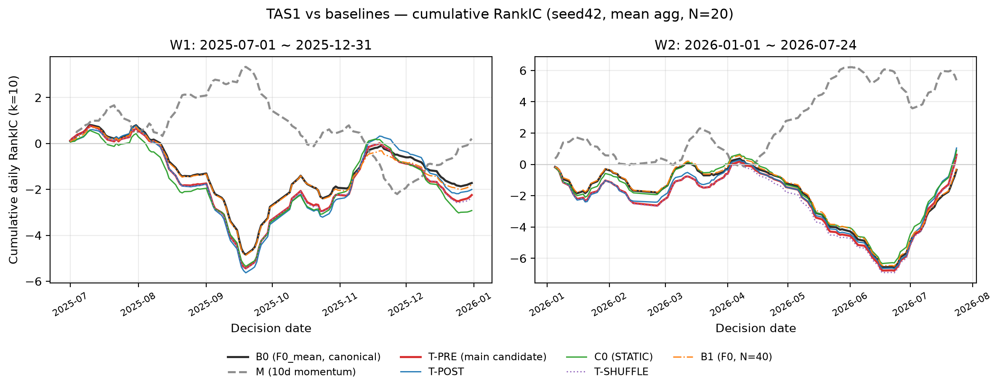
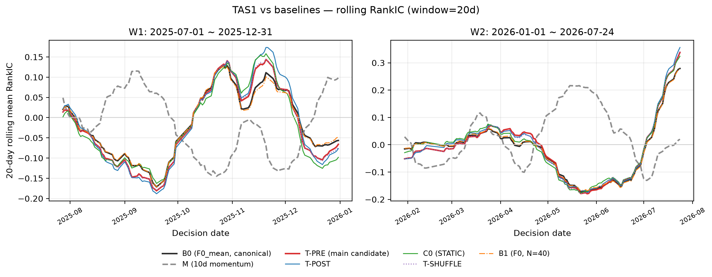
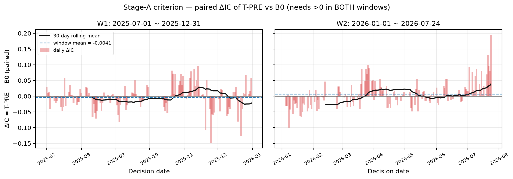
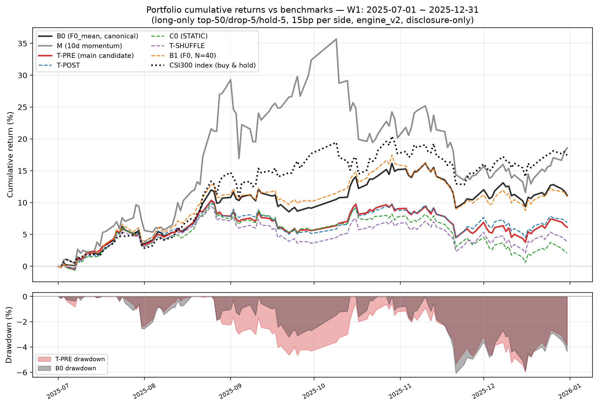
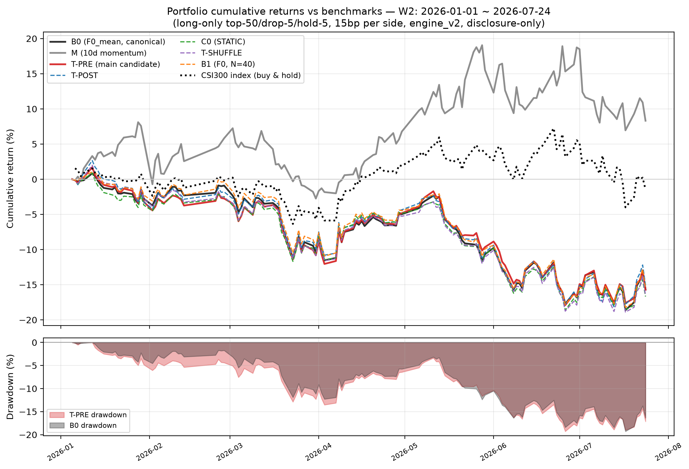

# TAS1 状态前置重读模型实验结果（2026-09-24）

> 分支 `codex/tas-state`。本文件是 TAS1 的**结题报告**：P2 阶段 A 判据未触发，
> 按预注册协议停止，不启动种子 43/44。判据与执行不可变更；下文诊断性披露
> 不构成对判决的任何修改。
> 上游：[实验计划](superpowers/plans/状态前置重读模型实验计划_20260922.md)、
> [P0/P1 进展](状态前置重读模型实验进展_20260922.md)（config sha256 `cd405028…`）。

## 1. 判决（阶段 A，计划 §6.2）

T-PRE（dynamic 族 seed42，选点 step1000）对 B0（canonical F0_mean）：

| 判据项 | W1（2025-07-01~12-31，126 日） | W2（2026-01-01~07-24，134 日） | 要求 | 结果 |
|---|---:|---:|---|---|
| T-PRE IC | **-0.0178** | +0.0046 | 两窗均 >0 | ❌ |
| ΔIC(B0) 配对 | **-0.0041** | +0.0072 | 两窗均 >0 | ❌ |

**判决：停止。** W1 两项均负，不满足"两窗均正"；不补种子、不换聚合/窗口/seed。
逐日序列与完整输出：`tas_state/data/pilot_unseal.json`。

失败模式归类（计划 §9）：训练 loss 从 ~5.5 降至 3.10、验证窗 RankIC +0.0678，
但历史窗 IC 未改善——"loss 下降但历史 IC 不增"的研究失败，非工程失败。

## 2. 验证选点记录（2025H1，107 决策日，PIT CSI300，N=20）

| 族 | step1000 | step2000 | step4000 | 选点 |
|---|---:|---:|---:|---|
| dynamic | **+0.0678** | +0.0620 | +0.0595 | step1000 |
| static | **+0.0604** | +0.0599 | +0.0590 | step1000 |

两族验证分随步数单调下降，与项目 G9 以来"alpha 在早期 epoch 后消失"一致。

## 3. 描述性披露（全臂两窗，判决后的诊断呈现，非判据）

| 臂 | W1 IC | W1 ΔIC(B0) | W2 IC | W2 ΔIC(B0) |
|---|---:|---:|---:|---:|
| B0（F0_mean 只读） | -0.0137 | — | -0.0026 | — |
| B3（M 只读） | +0.0017 | — | **+0.0401** | — |
| T-PRE | -0.0178 | -0.0041 | +0.0046 | +0.0072 |
| T-POST | -0.0159 | -0.0022 | **+0.0078** | +0.0104 |
| T-SHUFFLE | -0.0187 | -0.0051 | +0.0041 | +0.0067 |
| C0（STATIC） | -0.0232 | -0.0095 | +0.0067 | +0.0093 |
| B1（F0，N=40 官方路径） | -0.0143 | -0.0006 | -0.0021 | +0.0005 |

诊断读法（不改判决）：

### 3.1 组合层对照（engine_v2 完整口径，README 回测图同形式）

七臂 long-only top-50/drop-5/hold-5、单边 15bp、engine_v2 六项修正全开
（t 信号 t+1 收盘成交、涨跌停禁成交、年化 252）。AER 为相对基准的年化超额
（idx=CSI300 指数；ew=同池等权），完整字段见 `tas_state/data/backtest_perf.json`：

| 臂 | W1 AER(idx) | W2 AER(idx) | W1 AER(ew) | W2 AER(ew) |
|---|---:|---:|---:|---:|
| M | **+3.31%** | **+19.77%** | +2.74% | +28.73% |
| B0 | -11.27% | -26.19% | -10.98% | -20.80% |
| B1 | -11.62% | -25.83% | -11.34% | -20.45% |
| T-POST | -18.24% | -25.19% | -17.96% | -19.68% |
| T-PRE | -19.37% | -26.32% | -19.09% | -20.93% |
| T-SHUFFLE | -22.79% | -27.70% | -22.51% | -22.38% |
| C0 | -25.39% | -27.91% | -25.12% | -22.66% |

组合层与 IC 层方向一致：**两窗均无任何 TAS 变体的 AER 为正**（阶段 B
条件 5 的披露式呈现——该条件本就因阶段 A 停止而不适用）；M 在两窗均取得
正超额。T-PRE 相对 B0 在 W1 组合层亦显著更差（-19.37% vs -11.27%）。

执行备注：首版回测把行情拉到 data_end 且信号被 reindex 扩行，W1 组合
序列越界延伸到 2026-08（视觉验收抓出）；已改为窗口内+20 交易日缓冲，
上表与两图均为修正后口径。

### 3.2 诊断读法（IC 层）

1. **W1 是全臂环境性塌方**（B0 自身 -0.0137、只有 M 微正 +0.0017）；T 族不但
   无抗性，四变体全部比 B0 更差。
2. **W2 的微弱正 ΔIC 与状态前置机制无关**：POST 略优于 PRE（+0.0078 vs
   +0.0046），SHUFFLE（状态错配一位）几乎不退化（+0.0041），STATIC（固定
   平均 Z）+0.0067 同量级——样本动态状态与位置前置均无增量；微弱提升更可能
   来自"2024 全 A 语料微调适应性"本身（计划 §9 预设的"PRE 与 STATIC 无差 →
   样本动态状态没有显示额外贡献"路径）。
3. **B1（采样 N=40）与 B0 无差**（ΔIC -0.0006/+0.0005）——再次确认纯采样
   放大无增量（与 N50 结论一致）。

## 4. 执行账（命令、退出码、资源）

| 步骤 | 命令/产物 | 结果 |
|---|---|---|
| 训练 | `python -m tas_state.train --family {dynamic,static} --seed 42` | 各 4000 步、2397/2398s、final_loss 3.101/3.097 |
| 验证 | `python -m tas_state.validate --family {dynamic,static} --seed 42` | 两族选点 step1000；`outputs/*/validation.json` |
| 信号 | `python -m tas_state.signals --arms T-PRE T-POST T-SHUFFLE C0 B1 --window both` | 五臂两窗 260 日全落盘，覆盖 293~298 只/日（门禁 ≥30 通过） |
| 开封 | `python -m tas_state.evaluate --stage pilot --unseal --seed 42` | 退出码 0，判决停止；`data/pilot_unseal.json` |
| 总门禁 | `pytest tests/test_tas_*.py tests/test_baseline_suite.py tests/test_engine_v2.py -q` | 57 passed |

GPU 合计约 14 小时（训练 1.4h + 验证 6.3h + 信号 ~6.5h），P2 预算 24h 内。
执行中断两次（会话断开杀进程、GPU 并行竞争），均以同 seed 确定性重跑/断点
续跑恢复，协议无损。

## 5. 结论与边界

- **TAS1 命题被本轮证据否定**：在相同数据、采样与评估口径下，状态前置重读
  未击败 canonical baseline F0_mean，且诊断显示其微弱 W2 提升不可归因于状态
  机制（POST/SHUFFLE/STATIC 同等）。
- 验证窗强（+0.0678）而历史窗塌（-0.0178）——与项目 OOS 失败史一致，重申
  两个历史窗口不构成研究意义上的独立检验；本方案未进入前向登记，无新前向
  义务产生。
- 原 forward 协议保持封存未读取（仅 W2 尾部结算使用白名单价格缓冲，
  `register.assert_forward_seal(settlement_buffer=True)` 强制）。
- 不在同一轮扩张状态数/层数/L/损失/底座网格（计划 §9 停止规则）；后续新
  研究需另行预注册。

## 6. 遗留资产

- 代码与测试（`tas_state/` 全套 + 28 项 TAS 测试）可复用于后续两遍/adapter
  类改造的工程底座；旁路对拍（logits 零差异、token 一致率 1.0）保证 wrapper
  与官方路径数值同源。
- 五臂两窗信号 parquet 留 `tas_state/data/signals/s42/`（gitignore，不入库）；
  开封汇总 JSON 入库。
