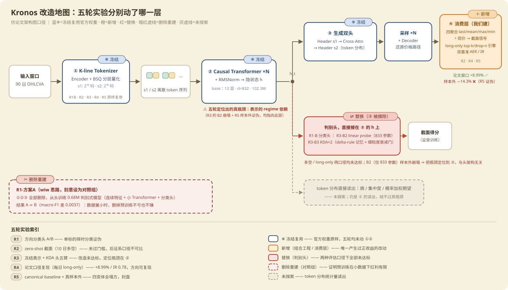

# Kronos A 股落地 · 项目总览与分支索引

> 日期：2026-08-12（六轮实验全部封盘后归档）
> 本文档位于 `integration` 分支——**仓库的实际主线**。`master` 是上游 Kronos 原样镜像，
> 不含本项目任何工作。
> 读这一份就够：下面有每个分支干了什么、跑出什么数、结论是什么、以及怎么继续。

---

## TL;DR

用官方 Kronos（K 线基础模型）在 A 股做量化选股，做了 **6 轮预注册实验**，结论是**否定的**：

> **zero-shot Kronos-base 在 A 股截面上没有可收割的独立 alpha。**它的信号本质接近一个
> 含噪的反动量/反转代理（与 10 日动量截面相关 **−0.51**），在特定窗口能"看起来"很好，
> 但换一年样本外就塌方，且始终跑不赢一个零成本的反转因子。

值得留下的不是结论，是**工具**：`kronos_qlib` 数据层、long-only 组合引擎、双基准剥离法、
样本外预注册协议，以及已并入 quant-qlib 主干的 Kronos qlib 封装。见 [§4 可复用资产](#4-可复用资产)。

**六轮里唯一一次正结果**（第 4 轮论文口径复现 AER +8.99%）在第 5 轮的真样本外被证伪——
这正是预注册纪律的价值：它在回测里被杀死，而不是在账户里。

---

## 1. 分支地图（Reference）

仓库共 10 个分支，三层结构：

```
master ─────────────── 上游 Kronos 原样镜像（2026-04-13，本项目未动）
  │
  ├── feature/direction-classifier ─── R1 方向分类头（独立，不在主链上）
  │
  └── feature/qlib-data-layer ──────── 数据层基座（kronos_qlib）
        │
        ├── integration ◄────────────── 【当前主线】数据层 + webui 改造，无实验代码
        │     └── feature/webui-qlib ── webui 接入 kronos_qlib（已并入 integration）
        │
        └── feature/cross-section-zeroshot ─ R2 截面 zero-shot
              └── feature/kda-repr-head ──── R3 KDA 头五臂
                    └── feature/paper-replication ─ R4 论文口径复现
                          └── feature/baseline-and-oos ─ R5 baseline + 真样本外
                                └── feature/liquidity-stratified ─ R6 流动性分层
```

**实验分支为什么不合并**：它们是**已封盘的历史记录**，不是待合入的代码。六轮口径互不相同
（多空 / long-only、10 日调仓 / 每日调仓），合进一条主线只会让人分不清哪份数字属于哪个口径。
分支边界就是口径边界。分支永久保留（删了 commit 会被 gc 回收）。

| 分支 | 轮次 | 一句话 | 结论 |
|---|---|---|---|
| `feature/qlib-data-layer` | 基座 | `kronos_qlib` 直连 DolphinDB 取数与构窗 | ✅ 9/9 验收，成为后续全部实验的地基 |
| `feature/direction-classifier` | R1 | 单标的择时：涨跌平三分类头（从头训练 vs 冻结主干 probe） | ❌ 证伪 |
| `feature/cross-section-zeroshot` | R2 | 截面选股：zero-shot 信号，10 日调仓多空 | ❌ 未过门槛（后证系口径不可比） |
| `feature/kda-repr-head` | R3 | 改造：冻结 Kronos 表示 + KDA 头，五臂对照 | ❌ 改造无效，瓶颈定位到表示层 |
| `feature/paper-replication` | R4 | 按论文口径复现：每日调仓 long-only top-50 | ⚠️ **唯一正结果** +8.99%，但 R5 推翻 |
| `feature/baseline-and-oos` | R5 | 立 canonical baseline + 真样本外一整年 | ❌ **样本外全塌方**，判定"窗口运气" |
| `feature/liquidity-stratified` | R6 | 审判"流动性越低越准"（外部说法） | ❌ 微盘 beta 假象，不敌免费反转 |
| `integration` | — | 数据层 + webui 接入，干净可用状态 | ✅ 当前主线 |
| `master` | — | 上游镜像，未动 | — |
| `kronos-ddb` | — | 上游 fork 的 DDB 适配分支（参考用） | — |

### 怎么读某个分支的文档

实验文档**只存在于各自分支**，在 `integration` 上看不到。不必切分支，直接读：

```bash
# 列出某分支的全部文档
git ls-tree -r --name-only feature/liquidity-stratified docs/ | grep '\.md$'

# 直接读某一份（不切分支、不动工作区）
git show feature/liquidity-stratified:docs/流动性分层检验结果_20260812.md | less

# 想跑代码再切
git checkout feature/liquidity-stratified
```

每轮都有配套的 `计划` + `结果` 两份文档：计划写在跑数**之前**（含预注册判据），结果写在封盘**之后**。
读结果文档前先读计划的判读章节，才知道这些数字是按什么标准判的。

---

## 2. 六轮实验详情（Reference）

### R1 · 方向分类头（`feature/direction-classifier`）

**问题**：把 Kronos 从生成式改成判别式，做单标的涨跌平三分类，能用吗？
**设定**：阿里 09988 港股 5 分钟 K 线，L=90/H=10，quantile 30/70 三分类。
方案 A = 删掉 Tokenizer 与生成头、从头训练 0.68M 小模型；方案 B = 冻结官方主干只训 linear probe。

| 臂 | macro-F1 | accuracy |
|---|---|---|
| 多数类基线 | 0.1837 | 0.3805 |
| 动量基线 | 0.3560 | 0.3608 |
| 方案 A（从头训练） | 0.3836 | 0.3958 |
| 方案 B（冻结 probe） | **0.3873** | 0.3896 |

**结论**：A ≈ B（差 0.0037，未达 0.02 显著门槛）→ 该任务上**预训练红利几乎不可见**；
两者都只微弱高于动量基线，金融口径下方案 A 平均每步收益 **0.000000**、胜率 49.3%（白干）。
单标的择时分类路线证伪。

文档：`docs/方向分类头AB实验结果_20260809.md`（计划、方案、交接说明同目录）

### R2 · 截面 zero-shot（`feature/cross-section-zeroshot`）

**问题**：官方 Kronos-base 零样本预测折算的"H 日平均预期收益率"，在 A 股截面上是有效因子吗？
**设定**：csi300 point-in-time，L=90/H=10，`signal = mean(pred_close[t+1..t+H])/close_t − 1`，
每 10 交易日调仓，2022-01-04~2026-07-22 共 111 期，5 分组多空。

| 因子 | RankIC | ICIR | t (n=111) | 多空年化(净) |
|---|---|---|---|---|
| **Kronos** | +0.0098 | +0.053 | +0.56 | **−10.57%** |
| 10 日动量 | +0.0094 | +0.045 | +0.48 | +0.66% |
| 10 日反转 | −0.0094 | −0.045 | −0.48 | −17.16% |

**结论**：未过预注册门槛（需 \|RankIC\|≥0.02 且 \|ICIR\|≥0.3）。分组收益近平坦无单调性。
**但**：事后用 `notebooklm` 核对论文与东证报告发现，我们与论文口径有**六处不同**
（模型规格、采样次数、回测区间、调仓频率、组合构建、报告指标），所以这一轮**不构成对论文的证伪**，
只是"本口径下不成立"。这个发现直接催生了 R4。

文档：`docs/截面路径zero-shot测试结果_20260810.md`（§4.1 有完整的口径差异对照表）

### R3 · KDA 头改造（`feature/kda-repr-head`）

**问题**：给冻结的 Kronos 表示加一个更强的下游头（Kimi Delta Attention），能救回来吗？
**设定**：五臂对照，训练 2022-01~2023-12 / 早停 2024-01~2024-06 / **最终验证 2024-07~2026-07（50 期，只跑一次封盘）**，含 10 交易日 purge。

| 臂 | 早停段 RankIC | 最终验证 RankIC | long-only 超额(等权，论文窗口) |
|---|---|---|---|
| B0 zero-shot（不训练） | — | **+0.0185** | +4.47% |
| B1 KDA 纯监督 | +0.108 | −0.0161 | −13.52% |
| B2 冻结 Kronos + linear probe（833 参数） | **+0.114 (t=7.46)** | −0.0008 | −11.63% |
| B3 冻结 Kronos + KDA 头 | +0.077 | +0.0075 | −13.23% |

**结论**：改造未达门槛（B3 < B0）。**最有诊断力的是 B2 的崩塌**——它只有 833 个参数、
train_loss 停在 0.98（几乎没拟合空间），却同样从早停段 t=7.46 跌到样本外归零。
这说明失效发生在**头的下面**：冻结表示里可读出的信号本身是 regime 依赖的。
换任何头都坐在同一份表示上 → **"继续迭代下游头"这条路被整体堵死**。

副产品：B1/B3 的最佳 epoch 都是 **1**（15M 参数在 14 万样本上第一轮即见顶），
说明 KDA 架构本身**没有得到公平审判**——但因为瓶颈在表示层，翻案已无意义。

文档：`docs/KDA改造实验结果_20260810.md`

### R4 · 论文口径复现（`feature/paper-replication`）

**问题**：论文报告的 A 股投资模拟结果，在我们的数据上、用开源的 base 规格，能复现吗？
**设定**：对齐论文四处口径——N=20 采样、2024-07~2025-06、**每日调仓 top-50/drop-5/最少持有 5 天 long-only**、
单边 0.15% 成本。锚点取论文附录 Table 10 的 **base 规格 CSI300：AER 0.1911 / IR 1.3782**
（注意：常被引用的 20.8% 是 Average 列，不是 CSI300 列；Kronos-large 未开源，上限即 base）。

| 组 | AER(指数) | IR | AER(等权，剥 beta) |
|---|---|---|---|
| **K Kronos** | **+8.99%** | **0.78** | **+4.47%** |
| M 动量 | −7.86% | −0.46 | −11.69% |
| R 反转 | +0.63% | +0.11 | −3.63% |
| P 随机占位（引擎零点门禁） | +4.29% | 0.61 | **−0.14%** ✅ |

**结论**：**论文方向可复现**（正超额、IR>0.5、跑赢两条免费基线），但未达锚点量级（差 10.12pp）。
**关键发现**：同一个信号（RankIC 仅 ~0.006–0.039），10 日调仓多空是 **−10.57%**，
每日调仓 long-only 是 **+8.99%**——**组合构建方式决定了信号能否变现**。

同时确立了两条方法论：**双基准**（市值加权指数对外口径 + 同池等权剥 beta）与
**占位零点门禁**（随机信号必须 ≈0，否则引擎自己在造 alpha）。前者的必要性由 P 组证明：
等权 top-50 对市值加权指数天然带 +4.4% beta 溢价，不剥离就会把 beta 当 alpha。

文档：`docs/论文口径复现结果_20260810.md`

### R5 · Baseline 与真样本外（`feature/baseline-and-oos`）· **决定性一轮**

**问题**：R4 的 +8.99% 是真本事还是窗口运气？
**设定**：先立 canonical baseline（四聚合变体 last/mean/max/min，**全部除以现价**修正价格尺度偏差；
canonical 主线 = mean，论文公式），再推到**从未被任何调参碰过的一整年** 2025-07~2026-07。

| 组 | 论文窗口 AER(指数)/AER(等权) | **样本外** AER(指数)/AER(等权) |
|---|---|---|
| **mean（canonical）** | +8.99% / +4.47% | **−14.29% / −15.10%** ❌ |
| last | +12.52% / +7.83% | −16.48% / −17.25% |
| max | +11.71% / +7.10% | −14.11% / −14.94% |
| min | +10.52% / +5.87% | −16.88% / −17.70% |
| M 动量 | −7.86% / −11.69% | **+23.28% / +21.40%** |
| P 占位（门禁） | +4.29% / −0.14% | −5.44% / −6.53% ✅ |

**结论**：预注册判据 3 命中——"论文窗口的正结果不能外推，**疑似窗口运气**"。四个聚合变体一起塌方
（聚合方式改不了信号的因子暴露）。

**机制（本项目最重要的一条认知）**：注意动量在两个窗口**反号**（−7.9% → +23.3%），
而 Kronos 信号与 10 日动量的截面相关是 **−0.51**。链条闭合：

> 论文窗口是动量失效期 → Kronos 的反动量倾向顺风 → +8.99%；
> 样本外是强动量期 → 同一倾向逆风 → −14.3%。
> **所谓 zero-shot alpha，主要是反动量敞口踩对了 regime。**

佐证：把动量中性化后，残差 RankIC 只有 +0.0138（仍低于 0.02 门槛）——剥掉动量轴本就没剩多少。

文档：`docs/基准与样本外测试结果_20260810.md`

### R6 · 流动性分层（`feature/liquidity-stratified`）

**问题**：外部说法"Kronos 流动性越低预测越准"（附一张漂亮净值图）成立吗？
**设定**：补齐原说法的三处硬伤——① PIT 月末滚动分档（非静态，防前视）；
② 窗口只用 **2024-07 之后**（Kronos 预训练截止 2024-06，隔离"背过的课文"）；
③ 用 `analyzer` + `qlib_bt` 补上停牌/一字板/涨跌停/成本处理。全 A 分三档 + csi300 对照。

| 档（流动性升序） | K 绝对 AER | **K 超额（剥 beta）** | P 占位超额 | 档内 spread（K vs R 反转） |
|---|---|---|---|---|
| lo5 [0,5%] | +49.88% | **−2.97%** | **+0.28%** | +2.95% (t=2.60) vs **+3.27%** |
| lo5_10 [5,10%] | +43.04% | +3.10% | −3.68% | +2.35% vs +2.22% |
| mid45_55 [45,55%] | +27.98% | **+6.04%** | −2.30% | +3.75% vs +2.79% |
| csi300 | +17.13% | +1.17% | — | −0.84% |

**结论**（五条预注册判读：门禁 ✅ / 信号存在 ✅ / 相对反转 ❌ / 单调性 ◐ / 经济性 ❌）：

1. **净值是 beta 不是 alpha**——最低档 Kronos 绝对 +49.9%，但**随机占位组 +56.0%（更高）**；
   剥离本档等权基准后 Kronos 是 **−3.0%**；
2. **档内分层真实但非 Kronos 独有**——spread +2.95%（t=2.60）成立，但**不及免费的 10 日反转 +3.27%**；
3. **"越低越准"方向相反**——中位档超额最高（+6.0%），最低档为负。

**副产品（附录 A）**：粗口径（不剔停牌/一字板、原始收盘价）会把分位 spread **夸大 7–10 倍**
并**颠倒 K/R 排名**——这就是外部那张"惊艳分层图"的技术成因。任何 A 股微盘回测不做这层处理，
结果都不可信。

文档：`docs/流动性分层检验结果_20260812.md` + `docs/流动性分层检验图文报告_20260812.md`（含四张图）

---

## 3. 为什么全是负结果（Explanation）

六轮的失败不是六个独立故障，是同一件事的六个切面。按"改哪一层"看：



| 层 | 动过吗 | 结果 |
|---|---|---|
| ① Tokenizer（BSQ 量化） | R1-A 删过（对照组） | 删掉不亏也不赚（数据量小时预训练红利有限） |
| ② Transformer 主干表示 | **从未动过**（zero-shot 或冻结） | **真瓶颈在这里**——表示的预测力 regime 依赖 |
| ③ 预测头 | R1-B / R3 换过（probe、KDA） | 换头救不了②（B2 用 833 参数证明） |
| ④ 输出消费方式 | R2/R4/R5/R6 反复改 | 能放大信号（−10.57% → +8.99%），**但不能创造跨期稳定性** |

**核心教训**：alpha 在组合工程（调仓频率、组合构建）而非模型改造——但组合工程只是放大器，
放大一个不稳定的信号，只会把不稳定也一起放大。

**唯一没开过的门是 ②**：真正的 A 股微调（更新主干权重）。六轮从未做过。

**为什么"生成得逼真"和"有预测力"不矛盾也不相干**：Kronos 能生成形态合理的未来 K 线
（webui 可视化就是干这个的，R4 阶段 2 也验证过预测路径量级正确）——它学的是 K 线的"语法"，
生成的是**一个说得通的未来**，不是**那个真实的未来**。可视化用途成立，交易信号用途不成立。

---

## 4. 可复用资产

结论是负的，工具是正的。这些与 Kronos 结论无关，任何 A 股信号研究都能直接用：

| 资产 | 位置 | 说明 |
|---|---|---|
| **`kronos_qlib` 数据层** | `integration`（本分支） | 直连 DolphinDB 取数 + point-in-time 成分 + 构窗；9/9 验收（含复权自洽性、PIT 成分、端到端冒烟、确定性） |
| **long-only 组合引擎** | `feature/paper-replication:paper_replication/engine.py` | top-k/drop-n + 最少持有期 + 成本；**含随机占位零点门禁**（5 条单测） |
| **双基准剥离法** | 同上 `benchmark.py` | 市值加权指数（对外口径）+ 同池等权（剥 beta / 门禁）；R6 证明缺了它会把 beta 当 alpha |
| **Kronos qlib 封装** | **已并入 quant-qlib 主干**（`745db120`） | `KronosZeroShotModel` / `KronosFinetuneModel`，标准 qlib `Model` 契约，可配 `RollingGen` |
| **webui + qlib** | `integration:webui/` | 单股预测可视化，已接 `kronos_qlib` 数据源 |
| **方法论纪律** | 各轮计划文档 | 预注册判据、样本外封盘、占位零点门禁、注入式因果测试、purge 切分 |

### 方法论纪律（比代码更值钱）

1. **预注册**：判读标准在跑数**之前**冻结写进计划文档，跑完不许改。R5 就是靠它把 +8.99% 判死的。
2. **样本外封盘**：留一整年谁都没碰过的数据，只跑一次。这是"回测好看"与"真的有用"之间唯一的闸门。
3. **占位零点门禁**：任何组合引擎必须先证明**随机信号在它手里赚不到钱**，否则测出来的 alpha 可能是引擎造的。
4. **免费基线对照**：新信号必须跑赢动量/反转这类零成本因子，否则再复杂的模型也没有存在理由。
5. **注入式测试**：写完防泄露/因果性测试后，**故意注入缺陷确认它会 FAIL**——否则你可能写了个恒真断言
   （本项目真的出过一次"6/6 通过但关键测试恒真"）。

---

## 5. 怎么继续（How-to）

### 用数据层做一个新信号的研究

```bash
git checkout integration
# .env 需配 DOLPHINDB_URI（见 .env.example）
python -c "
from kronos_qlib import QlibProvider, build_inference_windows
p = QlibProvider('csi300', '2024-01-01', '2026-08-07')
df_list, x_ts, y_ts, codes, stats = build_inference_windows(
    p, '2025-06-16', lookback=90, predict_len=10, pool='csi300')
print(stats)   # {'n_pool': 300, 'n_kept': 294, 'skipped_halt': 6, 'skipped_short': 0}
"
```

评估**必须**走 A 股口径：分组分析用 `analyzer.analyze_factor`
（`skip_paused=True, skip_one_word_limit=True, delay=1`），组合回测用 `qlib_bt.QlibBacktestEngine`
（涨跌停拦截 + `only_tradable=True`）。R6 附录 A 量化了不这么做的后果：**结果夸大 7–10 倍还会颠倒排名**。

### 复现某一轮的结果

```bash
git checkout feature/liquidity-stratified     # 换成目标分支
cat docs/流动性分层检验结果_20260812.md        # 先读"口径"与"判读"两节
python liquidity_strat/run_pipeline.py        # 各轮入口脚本名见该轮结果文档的"交付清单"
```

指标 JSON 都已入库（`*/data/*.json`），文档里每个数字都能在 JSON 里对上。
信号 parquet 体积大未入库，需要重跑生成。

### 如果要开"微调"这扇门

这是**唯一没走过的路**，基础设施已就位：

1. 模型走 quant-qlib 主干的 `KronosFinetuneModel`（tokenizer 冻结、token 级 CE，
   loss 口径对齐官方 `finetune/train_predictor.py`）；
2. 编排**必须**用 `RollingGen` 滚动重训——R3 死于一次性训练后 regime 变化，滚动重训是对症解药；
3. 判读**必须**先过样本外协议：留一年不碰的数据，预注册判据，跑一次封盘；
4. 参考两段式：官方管线是先微调 Tokenizer（让码本适应本地市场）再微调 Predictor，
   A 股特有形态（涨跌停板、T+1 跳空）是否被全球码本覆盖，本身就是未检验的问题。

**先验提示**：六轮证据对这条路不乐观（瓶颈在表示层，但小数据微调大概率复刻同样的 regime 过拟合）。
值不值得花这个算力，是价值判断，不是技术判断。

---

## 6. 环境与外部依赖

| 项 | 值 |
|---|---|
| 解释器 | `/home/user/miniconda3/envs/quant/bin/python`（torch 2.13+cu130，RTX 5090 32GB） |
| qlib | `pyqlib` editable 安装 → `/home/user/workspace/quant-qlib`（Kronos 封装已在其主干） |
| 数据 | DolphinDB（`.env` 的 `DOLPHINDB_URI`），日频数据末日 **2026-08-07** |
| 模型权重 | HuggingFace `NeoQuasar/Kronos-base` + `Kronos-Tokenizer-base`（large 未开源，上限 base 102.3M） |
| 外部依据 | 论文 arXiv:2508.02739（AAAI 2026）、东方证券解读报告；核对记录见 `feature/cross-section-zeroshot:docs/手动问notbook回复.md` |

**坑位提醒**（都踩过）：`D.calendar` 延伸到 2040 而真实数据止于 2026-08-07，取未来时间戳必须
以数据末日为界；`QlibDataLoader` 的 `swap_level=True` 下 level 0 是 datetime，reshape 一律按 level **名**；
instruments 传 list 时 `filter_pipe` 会被静默丢弃。

---

*六轮实验全程未做参数搜索；每轮判读标准均在跑数前冻结。这份索引连同各分支文档构成完整可追溯记录。*
